**Lorem Ipsum is simply dummy text of the printing and typesetting industry. Lorem Ipsum has been the industry's standard dummy text ever since the 1500s, when an unknown printer took a galley of type and scrambled it to make a type specimen book. It has survived not only five centuries, but also the leap into electronic typesetting, remaining essentially unchanged. It was popularised in the 1960s with the release of Letraset sheets containing Lorem Ipsum passages, and more recently with desktop publishing software like Aldus PageMaker including versions of Lorem Ipsum.**

# Packages

installer les packages suivants ..... + version min


```{r, eval = FALSE, message = FALSE, warning = FALSE}
install.packages(knitr)
install.packages(sf)
install.packages(mapsf)
install.packages(packcircles)
install.packages(cartogram)
install.packages(recmap)
install.packages("https://cran.r-project.org/src/contrib/Archive/cartogramR/cartogramR_1.0-1.tar.gz", repos = NULL, type = "source")
```


# Import et mise en forme des données

données INSEE (pop + CSP en 2018)

Le package **sf** bla bla bla.....

```{r, eval = TRUE, message = FALSE, warning = FALSE, results = "hide"}
library(sf)
communes <- st_read("data/isere.geojson", quiet = TRUE ) %>% st_transform(2154)
data <- read.csv("data/popisrere.csv",  dec = ",")
communes = merge(x = communes[,c("id","name","geometry")], 
                 y = data[,c("id", "pop2018","agri", "art", "cadr", "interm", "emp","ouvr","retr")],
                 by = "id")
isere = st_union(communes)
```

```{r, eval = TRUE, message = FALSE, warning = FALSE}
knitr::kable(communes[c(0:10),], row.names = F, digits = 1)
```

# mapsf

**Le package [mapsf](https://riatelab.github.io/mapsf/) permet de faire des cartes thématiques dans R. C'est le package qui succède au package **cartography**.**

Création d'un template cartographique

```{r, eval = TRUE, message = FALSE, warning = FALSE}
library(mapsf)

col = "#c291bc"
credits = paste0("Bronner Anne-Christine & Nicolas Lambert, 2021\n",
                  "Source: IGN & INSEE, 2021")
theme = mf_theme(x = "default", bg = "#f0f0f0", tab = FALSE, 
                   pos = "center", line = 2, inner = FALSE, 
                   fg = col, mar = c(0,0, 2, 0),cex = 1.9)

template = function(title, file, note = "", basemap = TRUE, scale = TRUE){
  
  mf_export(
    communes,
    export = "png",
    width = 1000,
    filename = file,
    res = 96,
    theme = theme, 
    expandBB = c(-.02,0,-.02,0)
  )
  
  if (basemap == TRUE){
    mf_shadow(x = communes, col = "grey50", cex = 1, add = TRUE)
    mf_map(communes, col ="#CCCCCC", border = "white", lwd = 0.5, add = TRUE)
  }
  
  mf_title(title)
  
  if (scale == TRUE){
    mf_scale(size = 20, pos = "bottomright", lwd = 1.2, cex = 1, col = "#383838", unit = "km")
  }
  
  mf_credits(
    txt = credits,
    pos = "bottomleft",
    col = "#1a2640",
    cex = 0.8,
    font = 3,
    bg = "#ffffff30"
  )
  
if(note != ""){
  mf_annotation(
    x = c(885000, 6435000),
    txt = note,
    pos = "bottomleft", cex = 1.2, font = 2,
    halo = TRUE, s = 1.5
)
  }

}

```

```{r, eval = TRUE, message = FALSE, warning = FALSE, results ="hide"}
template("Template cartographique", "maps/template.png", note = "Département de\nl'Isère (38)")
mf_map(communes, col = col, border = "white", lwd = 0.5, add = TRUE)
dev.off()
```
</img>

## Symboles proportionnels

```{r, eval = TRUE, message = FALSE, warning = FALSE, results ="hide"}
template("Symboles proportionnels (mapsf)", "maps/prop.png")
mf_map(communes, var = "pop2018", col = col, border = "#6b4266", type = "prop",
       inches = 0.8, leg_title_cex = 1.2, leg_val_cex	= 0.8,
       leg_title = "Nombre d'habitants, 2018")
dev.off()
```

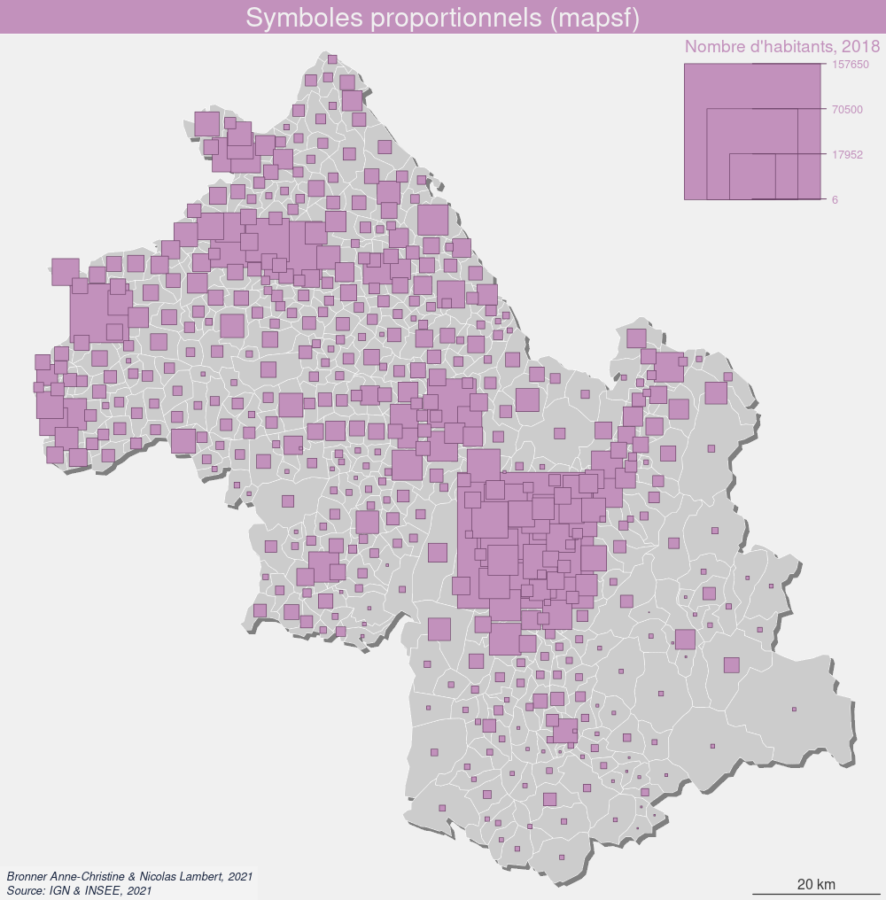</img>

```{r, eval = TRUE, message = FALSE, warning = FALSE, results ="hide"}
template("Symboles proportionnels (mapsf)", "maps/prop2.png")
mf_map(communes, var = "pop2018", col = col, border = "#6b4266", type = "prop",
       inches = 0.8, leg_title_cex = 1.2, leg_val_cex	= 0.8, symbol = "square",
       leg_title = "Nombre d'habitants, 2018")
dev.off()

```

</img>

## Dot density maps

```{r, eval = TRUE, message = FALSE, warning = FALSE, results ="hide"}
dotdensitymap <- function(x, var, onedot = 1, radius = 1){
x <- x[,c("id",var,"geometry")]
x[,"v"] <- round(x[,var] %>% st_drop_geometry() /onedot,0)
dots <- st_sample(x, x$v, type = "random", exact = TRUE)
circles <- st_buffer(dots, dist = radius)
return (circles)
}
```

```{r dotdensitymap, eval = TRUE, message = FALSE, warning = FALSE, results ="hide"}
onedot = 500
dots = dotdensitymap(x = communes, var = "pop2018", onedot = onedot, radius = 300)
template("Carte par points", "maps/dotdensity.png", note = paste0("Un point =\n",onedot," habitants"))
mf_map(dots, col = col, border = "#520a2c", lwd = 0.5, add = TRUE)
dev.off()
```

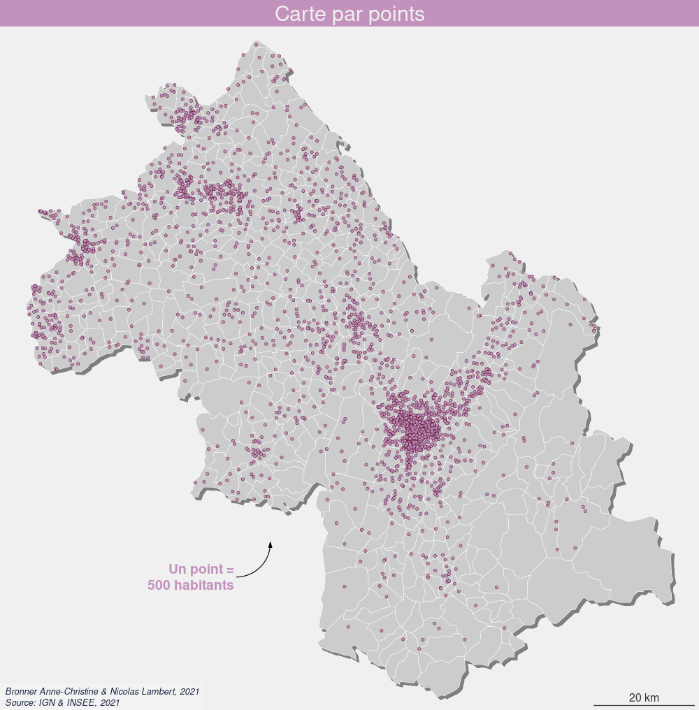</img>

## Simili Points Bertin

```{r Bertin, eval = TRUE, message = FALSE, warning = FALSE, results ="hide"}
if(!file.exists("files/grid.gpkg")){
  
  grid = st_make_grid(communes, cellsize = 1000, square = TRUE)
  grid = st_sf(id = c(1:length(grid)), geometry = grid)
  ids = communes[,"id"] %>% st_drop_geometry()
  ctr = st_centroid(grid)

  for(i in 1:nrow(grid)){
  x = st_within(x = ctr[i,], y = communes, sparse = TRUE, prepared = TRUE)
  id = ids[unlist(x),][1]
  if (length(id) == 0){id = NA}
  grid[i,"id"] = id
}

grid <- grid[!is.na(grid$id),]

for(i in 1:nrow(grid)){
  id = as.character(grid[i,"id"])[1]
  popAll = as.numeric(communes[communes$id == id,"pop2018"] %>% st_drop_geometry())
  count = nrow(grid[grid$id == id,])
  grid[i,"pop"] = popAll / count
}  

st_write(grid,"files/grid.gpkg", delete_layer=TRUE)
} else {
  grid = st_read("files/grid.gpkg")
}
```

```{r, eval = TRUE, message = FALSE, warning = FALSE, results ="hide"}
template("Points Bertin (grosso modo)", "maps/pointsbertin.png")
mf_map(communes, col = "#CCCCCC", border = "white", lwd = 0.5, add = FALSE)
mf_map(grid, var = "pop", col = col, border = "#520a2c", type = "prop",
       inches = 0.07, leg_title_cex = 1.2, leg_val_cex	= 0.8,
       leg_title = "Nombre d'habitants, 2018")

dev.off()
```

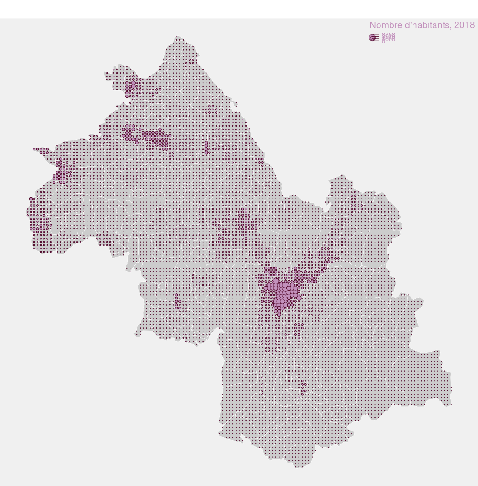</img>

# packcircles

**Le package [packcirles](https://github.com/mbedward/packcircles) propose 3 algorithmes simples pour déplacer des diques sur un plan 2D de telle sorte qu'ils ne se supperposent pas. Nous pouvons l'utiliser pour créer des cartogrammes de Dorling [@dorling1996area].**

Création d'un ficher de données simplifié avec les coordonnées des centroides des communes.

```{r, eval = TRUE, message = FALSE, warning = FALSE}
dots = communes
st_geometry(dots) <- st_centroid(sf::st_geometry(dots),of_largest_polygon = TRUE)
dots <- data.frame(dots$id, dots["pop2018"], st_coordinates(dots))
dots = dots[,c("dots.id","X","Y","pop2018")]
colnames(dots) <- c("id","x","y","v")
dots <- dots[!is.na(dots$v),]
knitr::kable(dots[c(0:5),], row.names = F, digits = 1)
```

La fonction *circleRepelLayout()* prend un ensemble de cercles dans un cadre de données et utilise la répulsion itérative pour essayer de trouver un arrangement sans chevauchement où tous les centres des cercles se trouvent à l'intérieur d'un rectangle de délimitation. Si aucun arrangement de ce type ne peut être trouvé dans le nombre maximum d'itérations spécifié, la dernière tentative est renvoyée.

```{r, eval = TRUE, message = FALSE, warning = FALSE}
library("packcircles")

k = 500 # pour ajuster la taille des cercles
itermax = 10 # nombre d'iterations

dat.init <- dots[,c("x","y","v")]
dat.init$v <- sqrt(dat.init$v * k)
simulation <- circleRepelLayout(x = dat.init, xysizecols = 1:3,
                                wrap = FALSE, sizetype = "radius",
                                maxiter = itermax, weights =1)$layout
knitr::kable(simulation[c(0:5),], row.names = F, digits = 1)
```


```{r, eval = TRUE, message = FALSE, warning = FALSE, resultes = "hide"}
circles <- st_buffer(sf::st_as_sf(simulation, coords =c('x', 'y'),
                      crs = sf::st_crs(communes)), dist = simulation$radius)
circles$v = dots$v

template("Dorling (packcircles)", "maps/dorling1.png", scale = FALSE)
mf_map(isere, col = "#CCCCCC", border = "white", lwd = 0.5, add = TRUE)
mf_map(circles,col = col, border = "#6b4266", lwd = 0.5, add = TRUE)
dev.off()
```

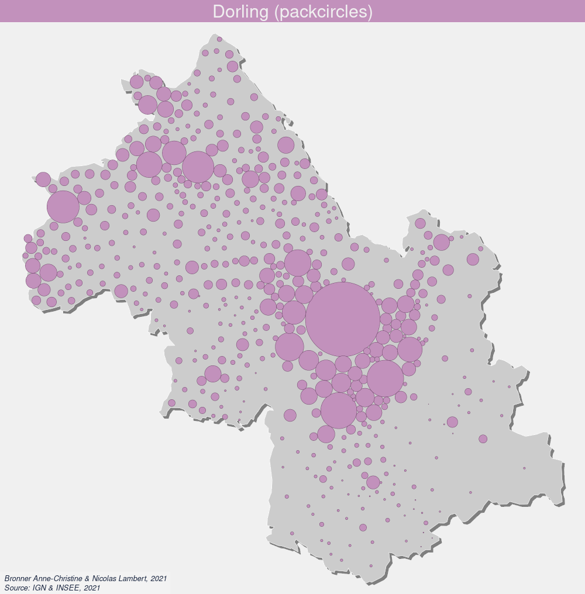</img>

# cartogram

**le package [cartogram](https://github.com/sjewo/cartogram) est développé par Sebastian Jeworutzki. Il propose trois méthodes : Dorling, Olson et Dougenik

```{r, eval = TRUE, message = FALSE, warning = FALSE}
library(cartogram)
```

## Dorling

```{r Dorling1, eval = TRUE, message = FALSE, warning = FALSE}
dorling = cartogram_dorling(communes, "pop2018", k = 1.8)
```

```{r Dorling2, eval = TRUE, message = FALSE, warning = FALSE, results = FALSE}
template("Dorling (cartogram)", "maps/dorling2.png", scale = FALSE)
mf_map(isere, col = "#CCCCCC", border = "white", lwd = 0.5, add = TRUE)
mf_map(dorling, col = col, border = "#6b4266", lwd = 0.5, add = TRUE)
dev.off()
```

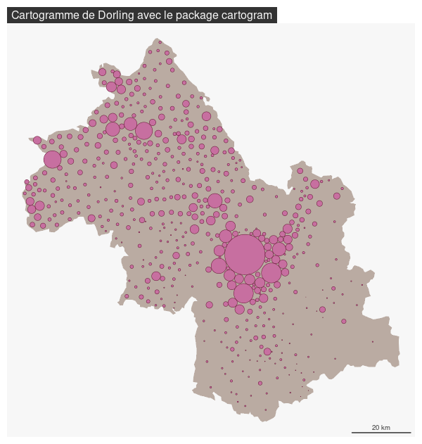</img>

## Olson

Bla bla bla cartogrammes discontinus.... [@olson1976noncontiguous]

x	: un objet sf
weight : nom de la variable
k : facteur pour augmenter la taille des polygons
inplace	: Si VRAI, chaque polygone est modifié à sa place initiale, si FAUX, les multi-polygones sont centrés sur leur centroïde initial

```{r Olsen1, eval = TRUE, message = FALSE, warning = FALSE}
olsen <- cartogram_ncont(communes, "pop2018", k = 1, inplace = TRUE)
```

```{r Olsen2, eval = TRUE, message = FALSE, warning = FALSE, results = FALSE}
template("Olsen (cartogram)", "maps/olsen.png", basemap = FALSE, scale = FALSE)
mf_map(isere, col = "#CCCCCC30", border = "white", lwd = 0.5, add = TRUE)
mf_map(olsen, col = col, border = "#6b4266", lwd = 0.5, add = TRUE)
dev.off()
```

</img>

## Douguenik

Bla bla bla.... [@dougenik1985algorithm]

x	: un objet sf
weight : om de la variable
itermax	: nombre d'itérations maximum si maxSizeError n'est pas atteint
maxSizeError : la déformation s'arrete si l'erreur moyenne est inférieur à cette valeur
prepare	: mettre "adjust" permer d'acceler le temps de calcul.
threshold	: seuil pour la préparation des données

```{r Dougenik1, eval = TRUE, message = FALSE, warning = FALSE}
Dougenik <- cartogram_cont(communes, "pop2018", prepare = "none", itermax = 10, maxSizeError = 1.15)
```

Calcul des érreurs

```{r Dougenik2, eval = TRUE, message = FALSE, warning = FALSE}
sumarea = sum(as.numeric(st_area(Dougenik)))
sumpop = sum(Dougenik$pop2018)
Dougenik$error = (as.numeric(st_area(Dougenik)) /  sumarea) / (Dougenik$pop2018 / sumpop) * 100
summary(Dougenik$error)
bks = c(min(Dougenik$error),70,80,90,100,110,120,max(Dougenik$error))
cols = c("#d53e4f", "#f46d43","#fdae61","#fee08b","#e6f598","#abdda4", "#66c2a5")
```

Affichage de la carte

```{r Dougenik3, eval = TRUE, message = FALSE, warning = FALSE, results = FALSE}
template("Dougenik (cartogram)", "maps/dougenik.png", basemap = FALSE, scale = FALSE)
mf_map(x = Dougenik, type = "choro",var = "error", pal = cols, breaks = bks, border = "#6b4266", lwd = 0.5, add = TRUE)
dev.off()
```

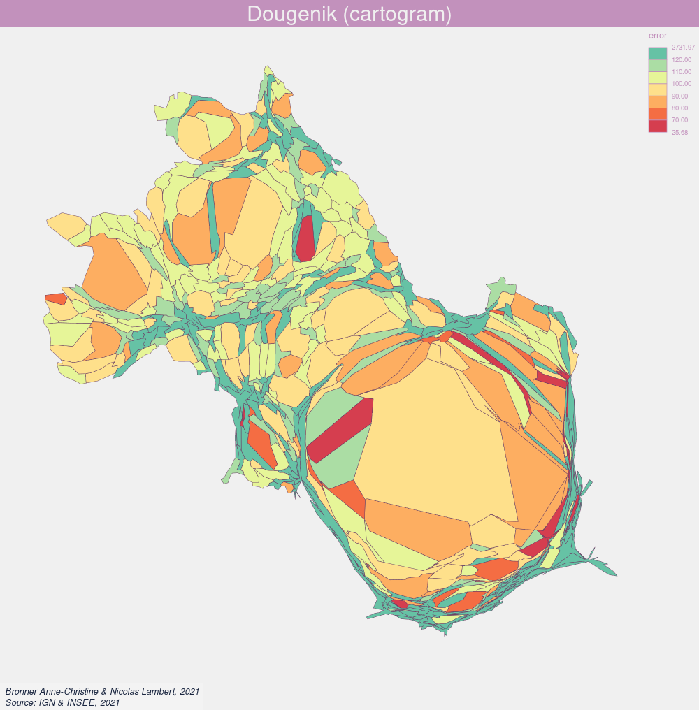</img>

# RecMap


Recmap [@heilmann2004recmap] [@panse2016rectangular] est un package développé par Christian Panse. Il perlet de concertir les géométries des unités spatiales en rectangles dont la surace est définie en fonction d'une donnée statitique sauntitative absolue. L'algorithe de RecMap est disponible [ici](https://ieeexplore.ieee.org/document/1382888). Développé en C++11, le package dépend des packages GA (>= 3.1), Rcpp (>= 1.0), sp(>= 1.3)

Attention, il ne fonctionne que sur un nombre limité d'unités territoriales. Et même dans ce cas, il ne fonctionne pas très bien, notamment avec les petites unités spatiales. 

```{r, eval = TRUE, message = FALSE, warning = FALSE, results = FALSE}
library(recmap)
```

Ici un exemple sur les pays d'Europe.

```{r, eval = TRUE, message = FALSE, warning = FALSE, results = FALSE}
europe <- st_read("data/europe.geojson")
```

Préparation des données

```{r, eval = TRUE, message = FALSE, warning = FALSE, results = FALSE}
coords = data.frame(st_coordinates(st_centroid(st_geometry(europe))))
bb <- lapply(st_geometry(europe), function(x){st_bbox(x)})
dx <- unlist(lapply(bb, function(x){x[3]-x[1]})) / 2
dy <- unlist(lapply(bb, function(x){x[4]-x[2]})) / 2

df <- data.frame(x = coords$X, 
                 y = coords$Y, 
                 dx = dx, 
                 dy = dy, 
                 z = europe$pop2008,
                 name = europe$id)
```

```{r, eval = TRUE, message = FALSE, warning = FALSE}
knitr::kable(df[c(0:10),], row.names = F, digits = 1)
```

```{r, eval = TRUE, message = FALSE, warning = FALSE, results = FALSE}
template("", "maps/recmap1.png", basemap = FALSE, scale = FALSE)
plot.recmap(df, col = NA, border = col, lwd=4,  col.text = col)
dev.off()
```

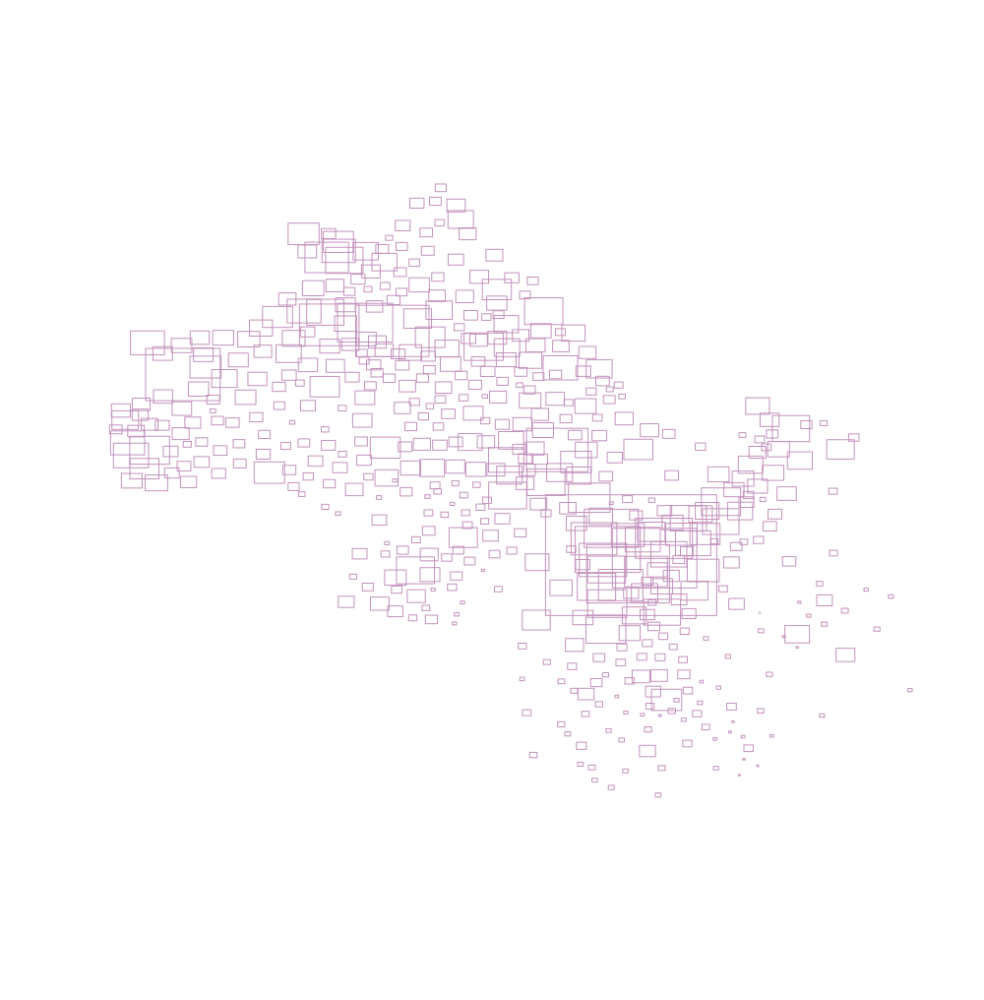</img>

```{r, eval = TRUE, message = FALSE, warning = FALSE, results = FALSE}
cartog <- recmap(df)
template("", "maps/recmap2.png", basemap = FALSE, scale = FALSE)
plot(cartog[!cartog$name %in% c("IS","MT"),],  col = col, border = "white")
dev.off()
```

NB : IS et MT n'ont pu être placés. On les supprime à l'affichage. 

</img>

# cartogramR

```{r, eval = TRUE, message = FALSE, warning = FALSE}
library(cartogramR)
```

Le package cartogramR est déveoppé par Pierre-Andre Cornillon et Florent Demoraes de l'université de Rennes. Le package propose les méthodes *flow based cartogram* [@gastner2004diffusion], *fast flow based cartogram* [@gastner2018fast] et *rubber band based cartogram* [@dougenik1985algorithm]. La méthode flow based cartogram est basée sur [go_cart](https://github.com/Flow-Based-Cartograms/go_cart).

Attention, cartogramR n'est pas/plus sur le CRAN. L'archive est néanmoins disponible et permet l'installation. 

la fonction *precartogramR()* aide à choisir la taille de la grille de déformation (calcul un peu long). 
on choisit donc a minima la grille telle que le minimum d'intersections est superieur ou egal a un (ici un pas de grille de 256 peut faire l'affaire)

```{r precartogramR, eval = TRUE, message = FALSE, warning = FALSE}
precarto <- precartogramR(communes, method = "GastnerSeguyMore")
summary(precarto)
```

la fonction *cartogramR()* parmet de calculer le cartogramme en tant que tel selon les 3 méthodes proposées : GastnerSeguyMore" (ou "gsm), "GastnerNewman" (ou "gn), "DougenikChrismanNiemeyer" (ou "dcn"). L'option *L=256* permet de choisir la taille de la grille. L'option *grid=TRUE* (pour les méthodes "gsm" et "gn") permet d'afficher la grille de déformation. L'option *maxit=50* permet de définir le nombre d'itérations max (défaut = 50).

```{r cartogramR, eval = TRUE, message = FALSE, warning = FALSE}
GastnerSeguy <- cartogramR(communes, count="pop2018", method="GastnerSeguyMore", options=list(L=256, grid=TRUE, maxit = 5))
```

La fonction *make_layer()* permet de récupérer la grille de calcul  (mais aussi la grille d'origine, les centroides, etc)

```{r, eval = TRUE, message = FALSE, warning = FALSE}
grid <- make_layer(GastnerSeguy, type = c("final_graticule"))
```

Ensuite, il est très facile d'afficher le cartogram avec plot (via *sf*) ou comme précédemment, avec le package *mapsf*.

```{r, eval = TRUE, message = FALSE, warning = FALSE, results = FALSE}
template("Gastner, Seguy & More", "maps/gastnerseguy.png", basemap = FALSE, scale = FALSE)
mf_map(GastnerSeguy$cartogram, col = col, border = "white", lwd = 1, add = TRUE)
mf_map(grid, col = NA, border = "#6b4266", lwd = 0.05, add = TRUE)
dev.off()
```

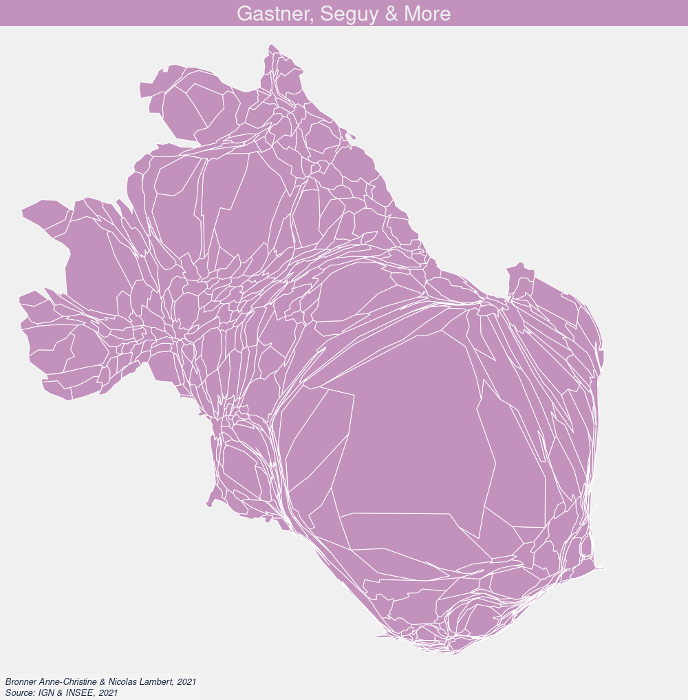</img>

La fonction residuals() permet de calculer les erreurs liées à la déformation (erreur relative : taille finale / taille theorique * 100)

```{r, eval = TRUE, message = FALSE, warning = FALSE}
table = cbind(GastnerSeguy$initial_data[,c("id","pop2018")] %>% st_drop_geometry(),
      orig_area = GastnerSeguy$orig_area,
      final_area = GastnerSeguy$final_area,
      errors = residuals(GastnerSeguy, type = "relative error")*100
      )
knitr::kable(table[c(0:10),], row.names = F, digits = 1)
```

Export au format sf

```{r, eval = TRUE, message = FALSE, warning = FALSE, results = FALSE}
st_write(as.sf(GastnerSeguy),"files/GastnerSeguy.gpkg", delete_layer=TRUE)
# GastnerSeguy_sf = st_as_sf(table, geometry = GastnerSeguy$cartogram)
# st_write(GastnerSeguy_sf,"files/GastnerSeguy.gpkg", delete_layer=TRUE)
```

# Variations

## Dots Cartograms

La méthode des dots cartograms est une représentation cartographique à l'intersection des cartogrammes de Dorling et des cartes par points. Les premières cartes utilisant cette méthodes ont été réalisées sur les données du Covid ([voir](https://analytics.huma-num.fr/Nicolas.Lambert/covid19/) et [voir](https://www.humanite.fr/covid-carte-interactive-visualisez-les-effets-dun-de-crise-sanitaire-sur-votre-region-697121)). Article à paraitre. Voir aussi sur [Observable](https://observablehq.com/d/23eaf5593be0ed2f)

```{r, eval = TRUE, message = FALSE, warning = FALSE, results = FALSE}
dotcartogram = function(x,var,itermax,onedot,radius){
crs = sf::st_crs(x)
coords <- st_coordinates(st_centroid(sf::st_geometry(x),of_largest_polygon = TRUE))
x <- x[c("id",var)] %>% st_drop_geometry()
x <- data.frame(x, coords)
colnames(x) <- c("id","v","x","y")
x$v <- round(x$v/onedot,0)
x <- x[x$v > 0,]
dots <- x[x$v == 1,c("x","y","v")]
rest <-  x[x$v  > 1,c("x","y","v")]

nb <- nrow(rest)
  for (i in 1:nb){
    new <- rest[i,]
    new$v <- 1
    for (j in 1:rest$v[i]){ dots <- rbind(dots,new)}
  }
  
dots$x <- jitter(dots$x)
dots$y <- jitter(dots$y)
dots$v <- radius
  
simulation <- circleRepelLayout(x = dots, xysizecols = 1:3,
                                  wrap = FALSE, sizetype = "radius",
                                  maxiter = itermax, weights =1)$layout

circles <- st_buffer(sf::st_as_sf(simulation, coords =c('x', 'y'),
                                    crs = crs), dist = radius) 
return(circles)
}
```

```{r, eval = TRUE, message = FALSE, warning = FALSE, results = FALSE}
onedot = 1000
dc = dotcartogram(x = communes, var = "pop2018", itermax = 120,
                  onedot = onedot, radius = 600)
```

```{r, eval = TRUE, message = FALSE, warning = FALSE, results = FALSE}
template("Dots Cartogram", "maps/dotcartogram.png", note = paste0("Un point =\n",onedot," personnes"), scale = FALSE)
mf_map(isere, col = "#CCCCCC", border = "white", lwd = 0.5, add = TRUE)
mf_map(dc, col = col, border = "#6b4266", lwd = 0.8, add = TRUE)
dev.off()
```

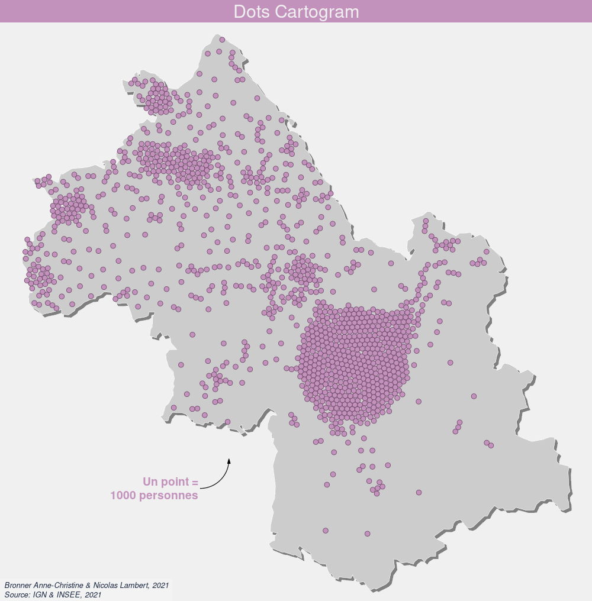</img>

## Anti Cartogramme

[@poncet2011antigeographie]

## Hex Cartogram

Ici, on essaye de reproduire les cartogrammes hexagonaux en trichant un peu....

```{r, eval = TRUE, message = FALSE, warning = FALSE, results = FALSE}
cartogram = st_read("files/GastnerSeguy.gpkg")
```

```{r gridcartogram, eval = TRUE, message = FALSE, warning = FALSE, results = FALSE}
grid = st_make_grid(cartogram, cellsize = 2000, square = FALSE)
grid = st_sf(id = rep("",length(grid)), geometry = grid)
ctr = st_centroid(grid)
ids = cartogram[,"id"] %>% st_drop_geometry()

for(i in 1:nrow(grid)){
  x = st_within(x = ctr[i,], y = cartogram, sparse = TRUE, prepared = TRUE)
  id = ids[unlist(x),][1]
  if (length(id) == 0){id = NA}
  grid[i,"id"] = id
}
grid <- grid[!is.na(grid$id),]

gridcartogram <- aggregate(x = grid, 
               by = list(grid$id),
               FUN = min)
```

Estimation de la valeur de chaque hexagone

```{r, eval = TRUE, message = FALSE, warning = FALSE, results = FALSE}
varmax = sum(cartogram$pop2018)
nbcell = nrow(grid)
valcell = round(varmax / nbcell)
```

Création de la carte

```{r, eval = TRUE, message = FALSE, warning = FALSE, results = FALSE}
template("Template cartographique", "maps/hexcartogram.png", note = paste0("Un hexagone ≈\n",valcell," habitants"),basemap = FALSE, scale = FALSE)
mf_shadow(x = grid, col = "grey50", cex = 1, add = TRUE)
mf_map(grid, col = col, border = "white", lwd = 0.5, add = TRUE)
mf_map(gridcartogram, col = NA, border = "#6b4266", lwd = 1, add = TRUE)
dev.off()
```

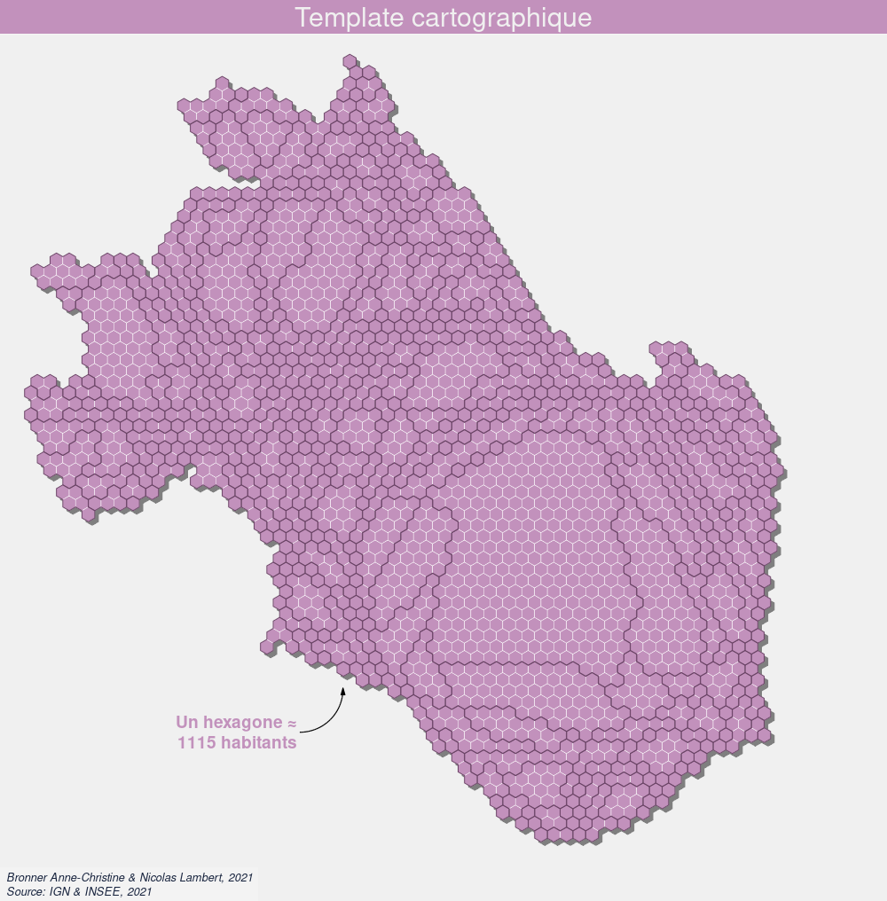</img>

# A vous de jouer

Explorez les cartogrammes à l'échelle mondiale.

```{r, eval = TRUE, message = FALSE, warning = FALSE, results = FALSE}
world <- st_read("data/world_countries.geojson", quiet = TRUE ) %>%
  st_transform( "+proj=bertin1953")

world <- world[world$ISO3 != "ATA",]
```

```{r, eval = TRUE, message = FALSE, warning = FALSE}
knitr::kable(world[c(0:10),], row.names = F, digits = 1)
```

Votre template cartographique

```{r, eval = TRUE, message = FALSE, warning = FALSE, results = FALSE}
col = "#c291bc"
credits = "Vous, 2021"
theme = mf_theme(x = "default", bg = "#f0f0f0", tab = FALSE, 
                   pos = "center", line = 2, inner = FALSE, 
                   fg = col, mar = c(0,0, 2, 0),cex = 1.9)

templateworld = function(title, file){

  mf_export(
    world,
    export = "png",
    width = 1000,
    filename = file,
    res = 96,
    theme = theme, 
    expandBB = c(-.02,0,-.02,0)
)

  mf_title(title)

  mf_credits(
    txt = credits,
    pos = "bottomleft",
    col = "#1a2640",
    cex = 0.8,
    font = 3,
    bg = "#ffffff30"
  )
}

```

Votre carte de base

```{r, eval = TRUE, message = FALSE, warning = FALSE, results = FALSE}
templateworld("Le monde en projection Bertin (thx Fil)", "maps/world.png")
mf_map(world, col =col, border = "white", lwd = 0.5, add = TRUE)
dev.off()
```

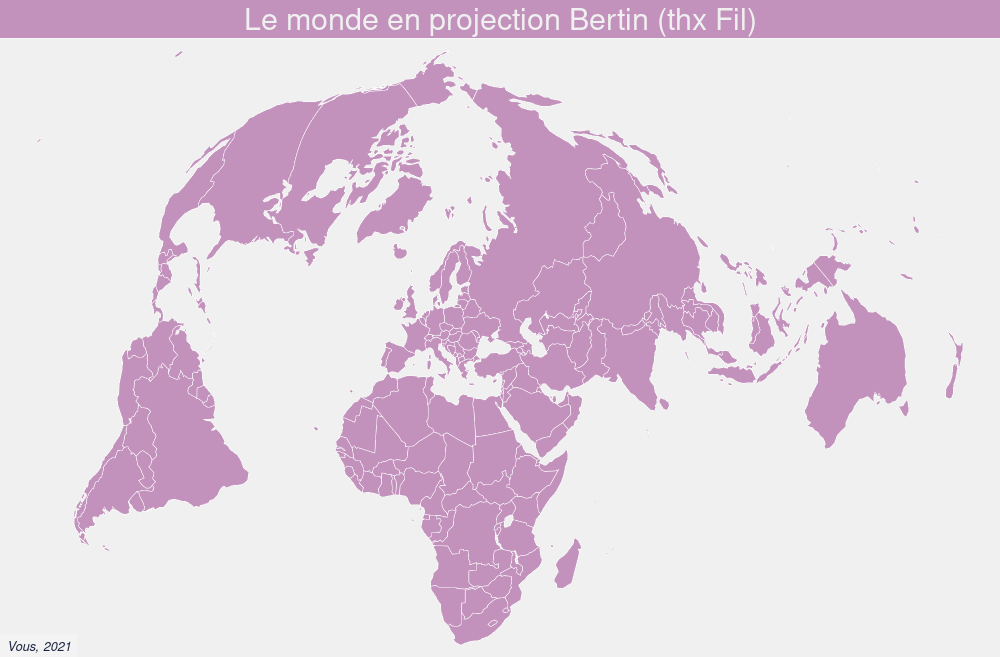</img>

A vous de jouer...

# Blibliographie

