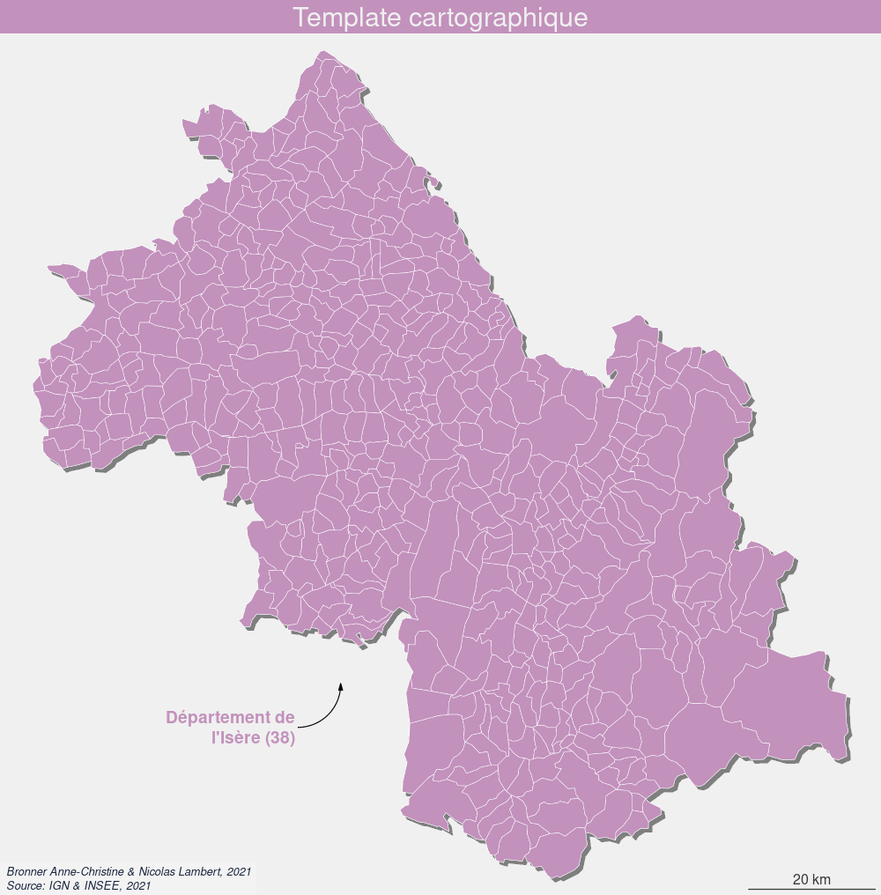

**Lorem Ipsum is simply dummy text of the printing and typesetting industry. Lorem Ipsum has been the industry's standard dummy text ever since the 1500s, when an unknown printer took a galley of type and scrambled it to make a type specimen book. It has survived not only five centuries, but also the leap into electronic typesetting, remaining essentially unchanged. It was popularised in the 1960s with the release of Letraset sheets containing Lorem Ipsum passages, and more recently with desktop publishing software like Aldus PageMaker including versions of Lorem Ipsum.**

# Packages

installer les packages suivants ..... + version min


```{r, eval = FALSE, message = FALSE, warning = FALSE}
install.packages(knitr)
install.packages(sf)
install.packages(mapsf)
install.packages(packcircles)
install.packages(cartogram)
install.packages(recmap)
install.packages("https://cran.r-project.org/src/contrib/Archive/cartogramR/cartogramR_1.0-1.tar.gz", repos = NULL, type = "source")
```


# Import et mise en forme des données

données INSEE (pop + CSP en 2018)

Le package **sf** bla bla bla.....

```{r, eval = TRUE, message = FALSE, warning = FALSE, results = "hide"}
library(sf)
communes <- st_read("data/isere.geojson", quiet = TRUE ) %>% st_transform(2154)
data <- read.csv("data/popisrere.csv",  dec = ",")
communes = merge(x = communes[,c("id","name","geometry")], 
                 y = data[,c("id", "pop2018","agri", "art", "cadr", "interm", "emp","ouvr","retr")],
                 by = "id")
isere = st_union(communes)
```

```{r, eval = TRUE, message = FALSE, warning = FALSE}
knitr::kable(communes[c(0:10),], row.names = F, digits = 1)
```

# mapsf

**Le package [mapsf](https://riatelab.github.io/mapsf/) permet de faire des cartes thématiques dans R. C'est le package qui succède au package **cartography**.**

Création d'un template cartographique

```{r, eval = TRUE, message = FALSE, warning = FALSE}
library(mapsf)

col = "#c291bc"
credits = paste0("Bronner Anne-Christine & Nicolas Lambert, 2021\n",
                  "Source: IGN & INSEE, 2021")
theme = mf_theme(x = "default", bg = "#f0f0f0", tab = FALSE, 
                   pos = "center", line = 2, inner = FALSE, 
                   fg = col, mar = c(0,0, 2, 0),cex = 1.9)

template = function(title, file, basemap = TRUE, scale = TRUE){

  mf_export(
    communes,
    export = "png",
    width = 1000,
    filename = file,
    res = 96,
    theme = theme, 
    expandBB = c(-.02,0,-.02,0)
)
  
if (basemap == TRUE){
  mf_shadow(x = communes, col = "grey50", cex = 1, add = TRUE)
  mf_map(communes, col ="#CCCCCC", border = "white", lwd = 0.5, add = TRUE)
}

mf_title(title)

if (scale == TRUE){
  mf_scale(size = 20, pos = "bottomright", lwd = 1.2, cex = 1, col = "#383838", unit = "km")
}

  mf_credits(
    txt = credits,
    pos = "bottomleft",
    col = "#1a2640",
    cex = 0.8,
    font = 3,
    bg = "#ffffff30"
  )
}


```

```{r, eval = TRUE, message = FALSE, warning = FALSE, results ="hide"}
template("Template cartographique", "maps/template.png")
mf_map(communes, col = col, border = "white", lwd = 0.5, add = TRUE)
dev.off()
```
</img>

Représenter des données quantitatives absolues avec mapsf

```{r, eval = TRUE, message = FALSE, warning = FALSE, results ="hide"}
template("Symboles proportionnels (mapsf)", "maps/prop.png")
mf_map(communes, var = "pop2018", col = col, border = "#6b4266", type = "prop",
       inches = 0.8, leg_title_cex = 1.2, leg_val_cex	= 0.8,
       leg_title = "Nombre d'habitants, 2018")
dev.off()
```

</img>

```{r, eval = TRUE, message = FALSE, warning = FALSE, results ="hide"}
template("Symboles proportionnels (mapsf)", "maps/prop2.png")
mf_map(communes, var = "pop2018", col = col, border = "#6b4266", type = "prop",
       inches = 0.8, leg_title_cex = 1.2, leg_val_cex	= 0.8, symbol = "square",
       leg_title = "Nombre d'habitants, 2018")
dev.off()
```

</img>

# packcircles

**Le package [packcirles](https://github.com/mbedward/packcircles) propose 3 algorithmes simples pour déplacer des diques sur un plan 2D de telle sorte qu'ils ne se supperposent pas. Nous pouvons l'utiliser pour créer des cartogrammes de Dorling [@dorling1996area].**

Création d'un ficher de données simplifié avec les coordonnées des centroides des communes.

```{r, eval = TRUE, message = FALSE, warning = FALSE}
dots = communes
st_geometry(dots) <- st_centroid(sf::st_geometry(dots),of_largest_polygon = TRUE)
dots <- data.frame(dots$id, dots["pop2018"], st_coordinates(dots))
dots = dots[,c("dots.id","X","Y","pop2018")]
colnames(dots) <- c("id","x","y","v")
dots <- dots[!is.na(dots$v),]
knitr::kable(dots[c(0:5),], row.names = F, digits = 1)
```

La fonction *circleRepelLayout()* prend un ensemble de cercles dans un cadre de données et utilise la répulsion itérative pour essayer de trouver un arrangement sans chevauchement où tous les centres des cercles se trouvent à l'intérieur d'un rectangle de délimitation. Si aucun arrangement de ce type ne peut être trouvé dans le nombre maximum d'itérations spécifié, la dernière tentative est renvoyée.


```{r, eval = TRUE, message = FALSE, warning = FALSE}
library("packcircles")

k = 500 # pour ajuster la taille des cercles
itermax = 10 # nombre d'iterations

dat.init <- dots[,c("x","y","v")]
dat.init$v <- sqrt(dat.init$v * k)
simulation <- circleRepelLayout(x = dat.init, xysizecols = 1:3,
                                wrap = FALSE, sizetype = "radius",
                                maxiter = itermax, weights =1)$layout
knitr::kable(simulation[c(0:5),], row.names = F, digits = 1)
```


```{r, eval = TRUE, message = FALSE, warning = FALSE, resultes = "hide"}

circles <- st_buffer(sf::st_as_sf(simulation, coords =c('x', 'y'),
                      crs = sf::st_crs(communes)), dist = simulation$radius)
circles$v = dots$v

template("Dorling (packcircles)", "maps/dorling1.png", scale = FALSE)
mf_map(isere, col = "#CCCCCC", border = "white", lwd = 0.5, add = TRUE)
mf_map(circles,col = col, border = "#6b4266", lwd = 0.5, add = TRUE)
dev.off()

```

</img>

# cartogram

**le package [cartogram](https://github.com/sjewo/cartogram) est développé par Sebastian Jeworutzki. Il propose trois méthodes : Dorling, Olson et Dougenik

```{r, eval = TRUE, message = FALSE, warning = FALSE}
library(cartogram)
```

## Dorling

```{r, eval = TRUE, message = FALSE, warning = FALSE}
dorling = cartogram_dorling(communes, "pop2018", k = 1.8)
```

```{r, eval = TRUE, message = FALSE, warning = FALSE, results = FALSE}
template("Dorling (cartogram)", "maps/dorling2.png", scale = FALSE)
mf_map(isere, col = "#CCCCCC", border = "white", lwd = 0.5, add = TRUE)
mf_map(dorling, col = col, border = "#6b4266", lwd = 0.5, add = TRUE)
dev.off()
```

</img>

## Olson

Bla bla bla cartogrammes discontinus.... [@olson1976noncontiguous]


x	: un objet sf
weight : nom de la variable
k : facteur pour augmenter la taille des polygons
inplace	: Si VRAI, chaque polygone est modifié à sa place initiale, si FAUX, les multi-polygones sont centrés sur leur centroïde initial

```{r, eval = TRUE, message = FALSE, warning = FALSE}
olsen <- cartogram_ncont(communes, "pop2018", k = 1, inplace = TRUE)
```

```{r, eval = TRUE, message = FALSE, warning = FALSE, results = FALSE}
template("Olsen (cartogram)", "maps/olsen.png", basemap = FALSE, scale = FALSE)
mf_map(isere, col = "#CCCCCC30", border = "white", lwd = 0.5, add = TRUE)
mf_map(olsen, col = col, border = "#6b4266", lwd = 0.5, add = TRUE)
dev.off()
```

</img>

## Douguenik

Bla bla bla.... [@dougenik1985algorithm]


x	: un objet sf
weight : om de la variable
itermax	: nombre d'itérations maximum si maxSizeError n'est pas atteint
maxSizeError : la déformation s'arrete si l'erreur moyenne est inférieur à cette valeur
prepare	: mettre "adjust" permer d'acceler le temps de calcul.
threshold	: seuil pour la préparation des données

```{r, eval = TRUE, message = FALSE, warning = FALSE}
Dougenik <- cartogram_cont(communes, "pop2018", prepare = "none", itermax = 150, maxSizeError = 1.15)
```

Calcul des érreurs

```{r, eval = TRUE, message = FALSE, warning = FALSE}
sumarea = sum(as.numeric(st_area(Dougenik)))
sumpop = sum(Dougenik$pop2018)
Dougenik$error = (as.numeric(st_area(Dougenik)) /  sumarea) / (Dougenik$pop2018 / sumpop) * 100
summary(Dougenik$error)
bks = c(min(Dougenik$error),70,80,90,100,110,120,max(Dougenik$error)) 
cols = c("#d53e4f", "#f46d43","#fdae61","#fee08b","#e6f598","#abdda4", "#66c2a5")
```

Affichage de la carte

```{r, eval = TRUE, message = FALSE, warning = FALSE, results = FALSE}
template("Dougenik (cartogram)", "maps/dougenik.png", basemap = FALSE, scale = FALSE)
#mf_map(Dougenik, col = col, border = "#6b4266", lwd = 0.5, add = TRUE)
mf_map(x = Dougenik, type = "choro",var = "error", pal = cols, breaks = bks, border = "#6b4266", lwd = 0.5, add = TRUE)
dev.off()
```

</img>

# cartogramR

# Variations

# A vous de jouer

Explorez les cartogrammes à l'échelle mondiale.

```{r, eval = TRUE, message = FALSE, warning = FALSE, results = FALSE}
world <- st_read("data/world_countries.geojson", quiet = TRUE ) %>%
  st_transform( "+proj=bertin1953")

world <- world[world$ISO3 != "ATA",]
```

```{r, eval = TRUE, message = FALSE, warning = FALSE}
knitr::kable(world[c(0:10),], row.names = F, digits = 1)
```

Votre template cartographique

```{r, eval = TRUE, message = FALSE, warning = FALSE, results = FALSE}
col = "#c291bc"
credits = "Vous, 2021"
theme = mf_theme(x = "default", bg = "#f0f0f0", tab = FALSE, 
                   pos = "center", line = 2, inner = FALSE, 
                   fg = col, mar = c(0,0, 2, 0),cex = 1.9)

templateworld = function(title, file){

  mf_export(
    world,
    export = "png",
    width = 1000,
    filename = file,
    res = 96,
    theme = theme, 
    expandBB = c(-.02,0,-.02,0)
)

  mf_title(title)

  mf_credits(
    txt = credits,
    pos = "bottomleft",
    col = "#1a2640",
    cex = 0.8,
    font = 3,
    bg = "#ffffff30"
  )
}

```

Votre carte de base

```{r, eval = TRUE, message = FALSE, warning = FALSE, results = FALSE}
templateworld("Le monde en projection Bertin (thx Fil)", "maps/world.png")
mf_map(world, col =col, border = "white", lwd = 0.5, add = TRUE)
dev.off()
```

</img>

A vous de jouer...

# Blibliographie

