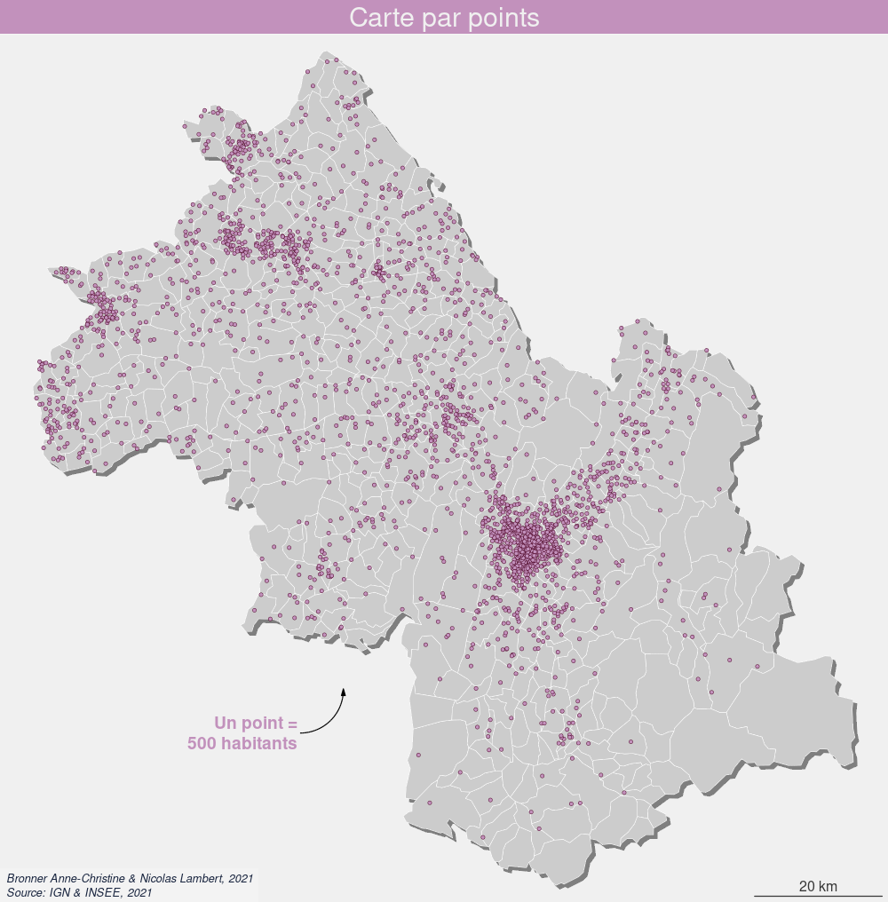
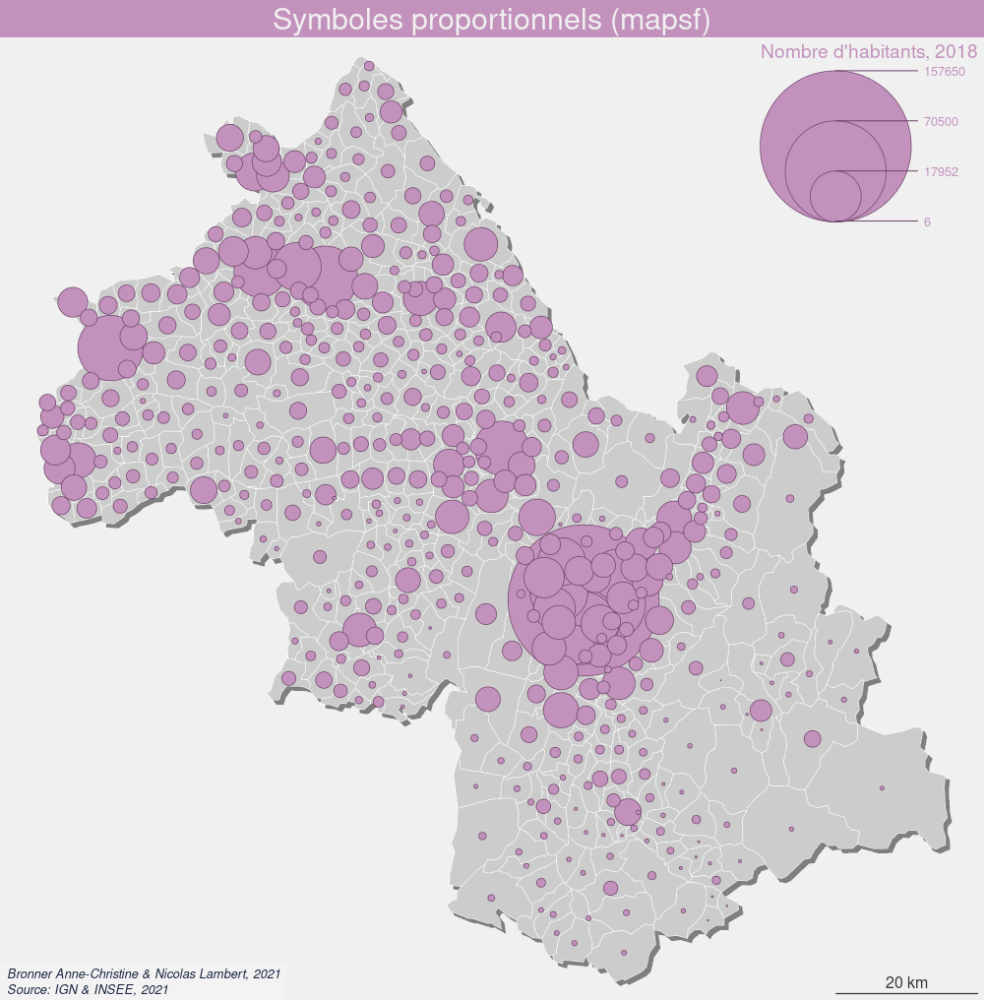
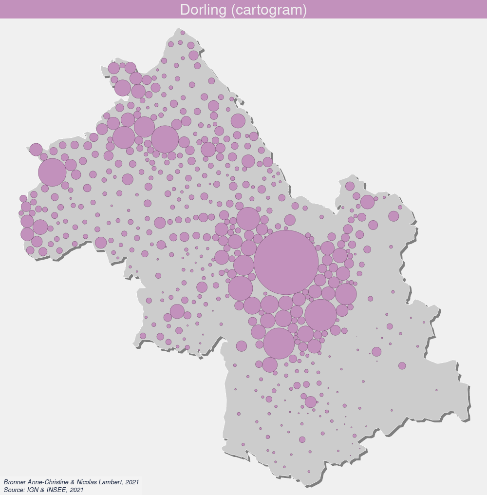
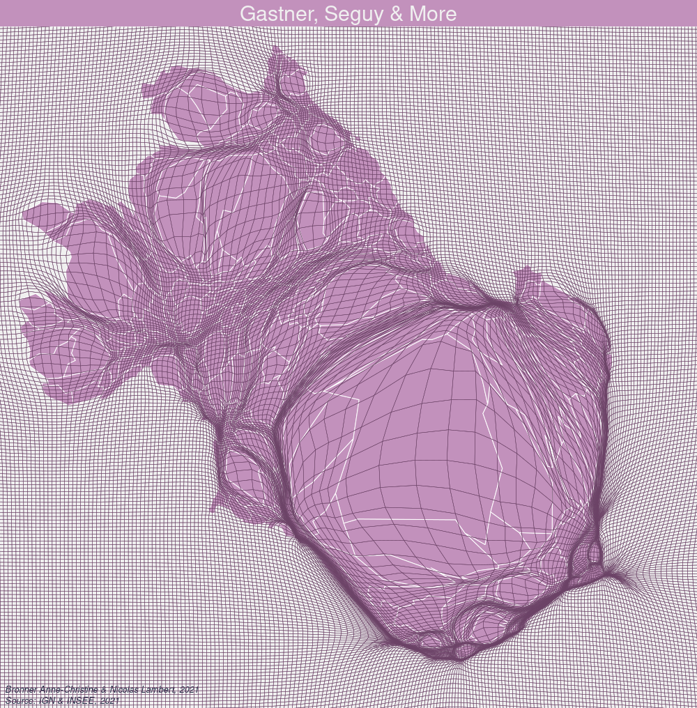
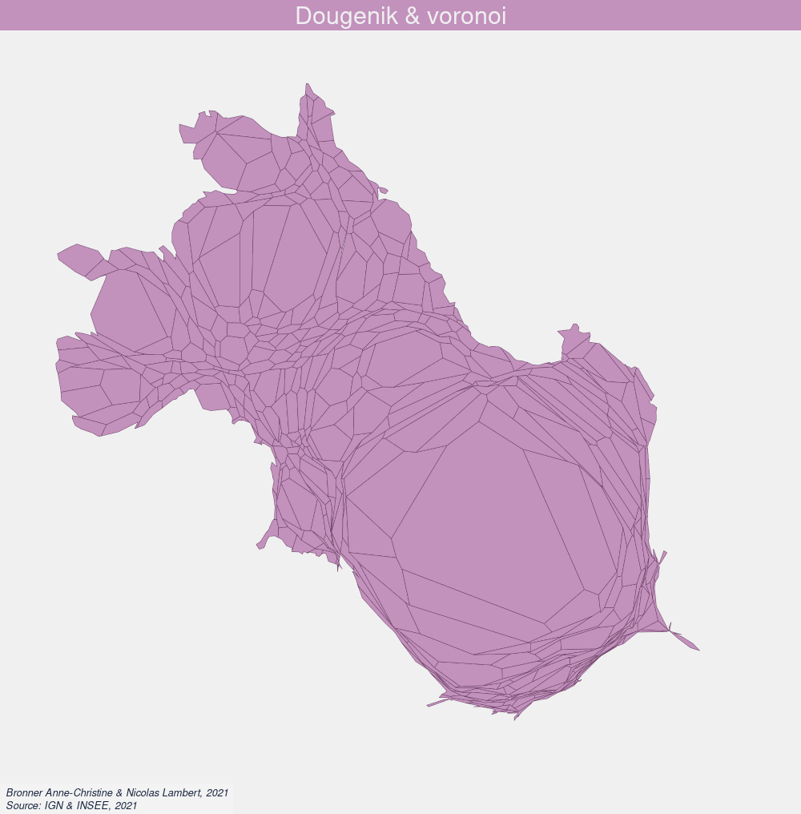
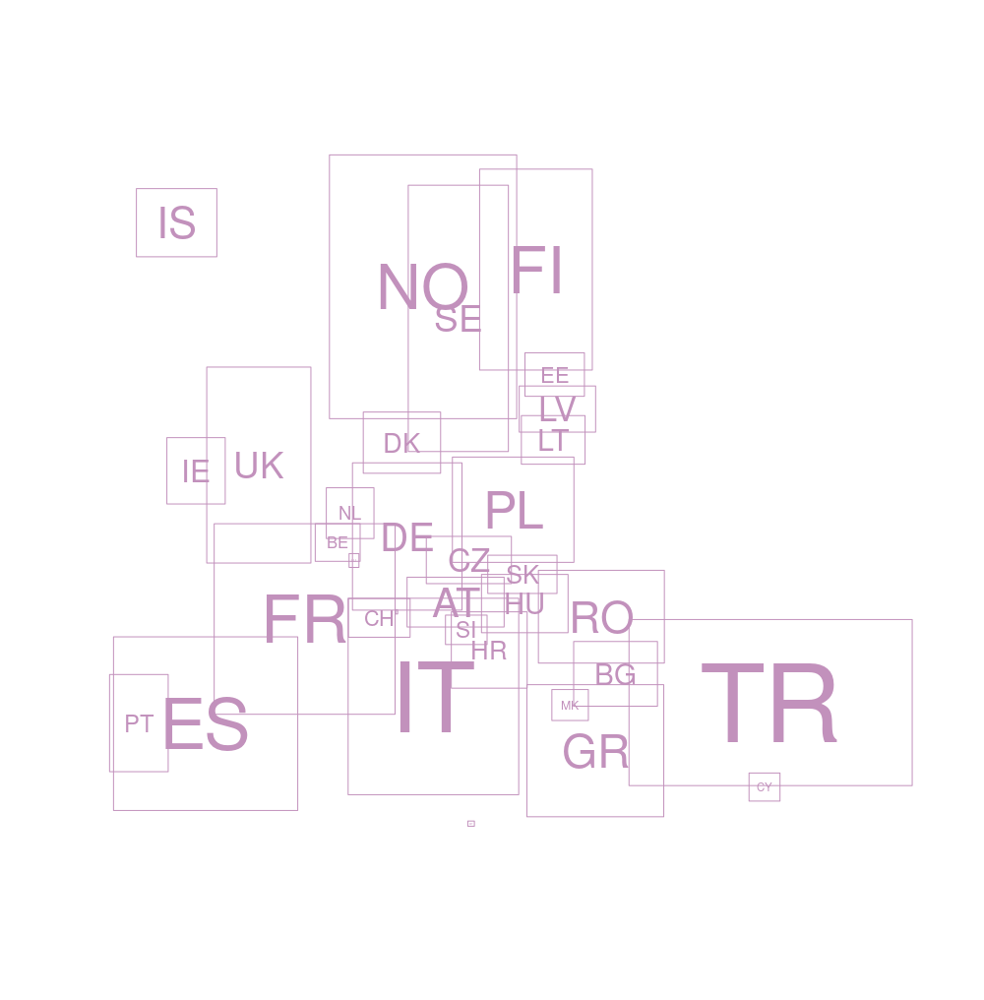

**Dans cette séquance, nous proposons d'explorer les différentes méthodes disponibles dans R, pour réaliser des cartogrammes basés sur des données quantitatibes absolues.**

# Préalables

## Installation des packages

```{r, eval = FALSE, message = FALSE, warning = FALSE}
install.packages(knitr)
install.packages(sf)
install.packages(mapsf)
install.packages(packcircles)
install.packages(cartogram)
install.packages(recmap)
install.packages(dplyr)
install.packages(cartogramR)
# install.packages("https://cran.r-project.org/src/contrib/Archive/cartogramR/cartogramR_1.0-1.tar.gz", repos = NULL, type = "source")
```

## Environnement de travail

1. Créez un nouveua projet
2. Créez un script R
3. Créez un répertoire data pour stocker vos données
4. Créez un répertoire *maps* pour ranger vos cartes

## Import et mise en forme des données

Les données utilisées ici sont des données INSSE sur la **populatiion** et les catégories socio professionelles en **2018** au **niveau communal**. L'espace d'étude est le département de l'**Isère**. 

Le package **sf** (pour simple features), développé principalement par Edzer Pebesma (et Roger Bivan), permet de gérer les objets spatiaux dans R (projections, geotraoitepents, etc.). C'est le package qui a succedé au package *sp*. 

```{r, eval = TRUE, message = FALSE, warning = FALSE, results = "hide"}
library(sf)
communes <-
  st_read(
    "https://raw.githubusercontent.com/transcarto/rcartograms/main/data/isere.geojson",
    quiet = TRUE
  ) %>% st_transform(2154)
data <-
  read.csv(
    "https://raw.githubusercontent.com/transcarto/rcartograms/main/data/popisrere.csv",
    dec = ","
  )
communes = merge(x = communes[, c("id", "name", "geometry")],
                 y = data[, c("id",
                              "pop2018",
                              "agri",
                              "art",
                              "cadr",
                              "interm",
                              "emp",
                              "ouvr",
                              "retr")],
                 by = "id")
isere = st_union(communes)
```

```{r, eval = TRUE, message = FALSE, warning = FALSE}
knitr::kable(communes[c(0:10),], row.names = F, digits = 1)
```
# Exploration des représentations par packages : les classiques

Rappel : il s'agit ici de résoudre la question de la représentation de quantités brutes associées à des surfaces.

</img>

## Rappel en carto "classique" avec le package mapsf

**Le package [mapsf](https://riatelab.github.io/mapsf/)** permet de faire des cartes thématiques dans R. C'est le package qui succède au package **cartography** (qui n'est plus maintenu).

Trois solutions existent pour cartographier des quantités brutes associées à des surfaces en cartographie dite "classique" : la dot map, les points valués et les symboles proportionnels.

### Création d'un template cartographique

```{r, eval = TRUE, message = FALSE, warning = FALSE}
library(mapsf)

col = "#c291bc"
credits = paste0("Bronner Anne-Christine & Nicolas Lambert, 2021\n",
                 "Source: IGN & INSEE, 2021")
theme = mf_theme(
  x = "default",
  bg = "#f0f0f0",
  tab = FALSE,
  pos = "center",
  line = 2,
  inner = FALSE,
  fg = col,
  mar = c(0, 0, 2, 0),
  cex = 1.9
)

template = function(title,
                    file,
                    note = "",
                    basemap = TRUE,
                    scale = TRUE) {
  mf_export(
    communes,
    export = "png",
    width = 1000,
    filename = file,
    res = 96,
    theme = theme,
    expandBB = c(-.02, 0, -.02, 0)
  )
  
  if (basemap == TRUE) {
    mf_shadow(
      x = communes,
      col = "grey50",
      cex = 1,
      add = TRUE
    )
    mf_map(
      communes,
      col = "#CCCCCC",
      border = "white",
      lwd = 0.5,
      add = TRUE
    )
  }
  
  mf_title(title)
  
  if (scale == TRUE) {
    mf_scale(
      size = 20,
      pos = "bottomright",
      lwd = 1.2,
      cex = 1,
      col = "#383838",
      unit = "km"
    )
  }
  
  mf_credits(
    txt = credits,
    pos = "bottomleft",
    col = "#1a2640",
    cex = 0.8,
    font = 3,
    bg = "#ffffff30"
  )
  
  if (note != "") {
    mf_annotation(
      x = c(885000, 6435000),
      txt = note,
      pos = "bottomleft",
      cex = 1.2,
      font = 2,
      halo = TRUE,
      s = 1.5
    )
  }
  
}

```

```{r, eval = TRUE, message = FALSE, warning = FALSE, results ="hide"}
template("Template cartographique", "maps/template.png", note = "Département de\nl'Isère (38)")
mf_map(
  communes,
  col = col,
  border = "white",
  lwd = 0.5,
  add = TRUE
)
dev.off()
```
</img>

### Dot density map ou carte par points

Il existe plusieurs solutions pour réaliser une carte par point dans R. Ici, nous vous proposeons de créer une fonction qui s'appuie sur *st_sample()* du package *sf*

```{r, eval = TRUE, message = FALSE, warning = FALSE, results ="hide"}
dotdensitymap <- function(x,
                          var,
                          onedot = 1,
                          radius = 1) {
  x <- x[, c("id", var, "geometry")]
  x[, "v"] <- round(x[, var] %>% st_drop_geometry() / onedot, 0)
  dots <- st_sample(x, x$v, type = "random", exact = TRUE)
  circles <- st_buffer(dots, dist = radius)
  return (circles)
}
```

```{r dotdensitymap, eval = TRUE, message = FALSE, warning = FALSE, results ="hide"}
onedot = 500
dots = dotdensitymap(
  x = communes,
  var = "pop2018",
  onedot = onedot,
  radius = 300
)
template("Carte par points",
         "maps/dotdensity.png",
         note = paste0("Un point =\n", onedot, " habitants"))
mf_map(
  dots,
  col = col,
  border = "#520a2c",
  lwd = 0.5,
  add = TRUE
)
dev.off()
```

</img>

### (Simili) Points Bertin ou points valués

</img>

Les points valués, appelés également "points Bertin" sont une variante de la dot map, avec deux-trois taille de points de référence pour s'adapter à de fortes disparités dans la distribution des effectifs. L'algorithme ci-après approche l'idée en distribuant les effectifs de chaque entité sur une grille sur des points de taille variable.

```{r Bertin, eval = TRUE, message = FALSE, warning = FALSE, results ="hide"}
  grid = st_make_grid(communes, cellsize = 1000, square = TRUE)
  grid = st_sf(id = c(1:length(grid)), geometry = grid)
  ids = communes[, "id"] %>% st_drop_geometry()
  ctr = st_centroid(grid)
  
  for (i in 1:nrow(grid)) {
    x = st_within(
      x = ctr[i, ],
      y = communes,
      sparse = TRUE,
      prepared = TRUE
    )
    id = ids[unlist(x), ][1]
    if (length(id) == 0) {
      id = NA
    }
    grid[i, "id"] = id
  }
  
  grid <- grid[!is.na(grid$id), ]
  
  for (i in 1:nrow(grid)) {
    id = as.character(grid[i, "id"])[1]
    popAll = as.numeric(communes[communes$id == id, "pop2018"] %>% st_drop_geometry())
    count = nrow(grid[grid$id == id, ])
    grid[i, "pop"] = popAll / count
  }
  
  st_write(grid, "data/grid.geojson", delete_layer = TRUE)
```

La grille est maintenant disponible dans votre répertoire data.

Vous pouvez aussi aller chercher la grille précalulée ici

```{r, eval = TRUE, message = FALSE, warning = FALSE, results ="hide"}
grid = st_read("https://raw.githubusercontent.com/transcarto/rcartograms/main/data/grid.geojson")
```

```{r, eval = TRUE, message = FALSE, warning = FALSE, results ="hide"}
template("Points Bertin (grosso modo)", "maps/pointsbertin.png")
mf_map(communes, col = "#CCCCCC", border = "white", lwd = 0.5, add = FALSE)
mf_map(grid, var = "pop", col = col, border = "#520a2c", type = "prop",
       inches = 0.07, leg_title_cex = 1.2, leg_val_cex	= 0.8,
       leg_title = "Nombre d'habitants, 2018")

dev.off()
```

</img>

### Symboles proportionnels

C'est la représentation la plus usuelle pour représenter des données quantitatives absolues. 

```{r, eval = TRUE, message = FALSE, warning = FALSE, results ="hide"}
template("Symboles proportionnels (mapsf)", "maps/prop.png")
mf_map(communes, var = "pop2018", col = col, border = "#6b4266", type = "prop",
       inches = 0.8, leg_title_cex = 1.2, leg_val_cex	= 0.8, symbol = "square",
       leg_title = "Nombre d'habitants, 2018")
dev.off()

```

</img>

```{r, eval = TRUE, message = FALSE, warning = FALSE, results ="hide"}
template("Symboles proportionnels (mapsf)", "maps/prop2.png")
mf_map(communes, var = "pop2018", col = col, border = "#6b4266", type = "prop",
       inches = 0.8, leg_title_cex = 1.2, leg_val_cex	= 0.8,
       leg_title = "Nombre d'habitants, 2018")
dev.off()
```

</img>

##  Le cartogramme circulaire de Dorling avec le package packcircles

**Le package [packcirles](https://github.com/mbedward/packcircles) propose 3 algorithmes simples pour déplacer des disques sur un plan 2D de telle sorte qu'ils ne se supperposent pas. Nous pouvons l'utiliser pour créer des cartogrammes de Dorling [@dorling1996area].**

Création d'un ficher de données simplifié avec les coordonnées des centroïdes des communes.

```{r, eval = TRUE, message = FALSE, warning = FALSE}
dots = communes
st_geometry(dots) <- st_centroid(sf::st_geometry(dots),of_largest_polygon = TRUE)
dots <- data.frame(dots$id, dots["pop2018"], st_coordinates(dots))
dots = dots[,c("dots.id","X","Y","pop2018")]
colnames(dots) <- c("id","x","y","v")
dots <- dots[!is.na(dots$v),]
knitr::kable(dots[c(0:5),], row.names = F, digits = 1)
```

La fonction *circleRepelLayout()* prend un ensemble de cercles dans un cadre de données et utilise la répulsion itérative pour essayer de trouver un arrangement sans chevauchement où tous les centres des cercles se trouvent à l'intérieur d'un rectangle de délimitation. Si aucun arrangement de ce type ne peut être trouvé dans le nombre maximum d'itérations spécifié, la dernière tentative est renvoyée.

```{r, eval = TRUE, message = FALSE, warning = FALSE}
library("packcircles")

k = 500 # pour ajuster la taille des cercles
itermax = 10 # nombre d'iterations

dat.init <- dots[,c("x","y","v")]
dat.init$v <- sqrt(dat.init$v * k)
simulation <- circleRepelLayout(x = dat.init, xysizecols = 1:3,
                                wrap = FALSE, sizetype = "radius",
                                maxiter = itermax, weights =1)$layout
knitr::kable(simulation[c(0:5),], row.names = F, digits = 1)
```


```{r, eval = TRUE, message = FALSE, warning = FALSE, resultes = "hide"}
circles <- st_buffer(sf::st_as_sf(simulation, coords =c('x', 'y'),
                      crs = sf::st_crs(communes)), dist = simulation$radius)
circles$v = dots$v

template("Dorling (packcircles)", "maps/dorling1.png", scale = FALSE)
mf_map(isere, col = "#CCCCCC", border = "white", lwd = 0.5, add = TRUE)
mf_map(circles,col = col, border = "#6b4266", lwd = 0.5, add = TRUE)
dev.off()
```

</img>

## Les 3 formes classiques avec le package cartogram

**le package [cartogram](https://github.com/sjewo/cartogram)** est développé par Sebastian Jeworutzki. Il propose trois méthodes : le cartogramme **circulaire**  de Dorling, continu de Dougenik, Chrisman et Niemeyer et **discontinu** d'Olson).

```{r, eval = TRUE, message = FALSE, warning = FALSE}
library(cartogram)
```

### Le cartogramme circulaire de Dorling

Proche d'un traitement graphique de l'information (le bubble chart), l'algorithme de Danny Dorling permet de visualiser les grandes masses de population en prenant en compte les positions relatives des entités les unes par rapport aux autres.

```{r Dorling1, eval = TRUE, message = FALSE, warning = FALSE}
Dorling = cartogram_dorling(communes, "pop2018", k = 1.8)
```

```{r Dorling2, eval = TRUE, message = FALSE, warning = FALSE, results = FALSE}
template("Dorling (cartogram)", "maps/dorling2.png", scale = FALSE)
mf_map(isere, col = "#CCCCCC", border = "white", lwd = 0.5, add = TRUE)
mf_map(Dorling, col = col, border = "#6b4266", lwd = 0.5, add = TRUE)
dev.off()
```

</img>

### Le cartogramme discontinu d'Olson

Judith Olson, en réaction aux premiers cartogrammes continus de Tobler et notamment les problèmes de lisibilité, propose une variation proportionnelle de la surface tout en gardant sa forme "géographique" [@olson1976noncontiguous]

```{r Olson1, eval = TRUE, message = FALSE, warning = FALSE}
Olson <- cartogram_ncont(communes, "pop2018", k = 1, inplace = TRUE)
```

inplace	: Si VRAI, chaque polygone est redimensioné à sa place initiale, si FAUX, les multi-polygones sont centrés sur leur centroïde initial.

```{r Olson2, eval=TRUE, message=FALSE, warning=FALSE, results=FALSE}
template("Olson (cartogram)", "maps/olson.png", basemap = FALSE, scale = FALSE)
mf_map(isere, col = "#CCCCCC30", border = "white", lwd = 0.5, add = TRUE)
mf_map(Olson, col = col, border = "#6b4266", lwd = 0.5, add = TRUE)
dev.off()
```

</img>

### Le cartogramme continu Dougenik

James A. Dougenik, Nicholas R. Chrisman et Duane R.Niemeyer, sur la base des premiers travaux de W. Tobler, développent en 1985 un des deux algorithmes les plus implanté dans les outils (avec celui de Gastner et Newman développé en 2004). [@dougenik1985algorithm]

x	: un objet sf
weight : om de la variable
itermax	: nombre d'itérations maximum si maxSizeError n'est pas atteint
maxSizeError : la déformation s'arrete si l'erreur moyenne est inférieur à cette valeur
prepare	: mettre "adjust" permer d'acceler le temps de calcul.
threshold	: seuil pour la préparation des données

```{r Dougenik1, eval = TRUE, message = FALSE, warning = FALSE}
Dougenik <- cartogram_cont(communes, "pop2018", prepare = "none", itermax = 10, maxSizeError = 1.15)
```

**Calcul des erreurs**

```{r Dougenik2, eval = TRUE, message = FALSE, warning = FALSE}
sumarea = sum(as.numeric(st_area(Dougenik)))
sumpop = sum(Dougenik$pop2018)
Dougenik$error = (as.numeric(st_area(Dougenik)) /  sumarea) / (Dougenik$pop2018 / sumpop) * 100
summary(Dougenik$error)
bks = c(min(Dougenik$error),70,80,90,100,110,120,max(Dougenik$error))
cols = c("#d53e4f", "#f46d43","#fdae61","#fee08b","#e6f598","#abdda4", "#66c2a5")
```

**Affichage de la carte**

```{r Dougenik3, eval = TRUE, message = FALSE, warning = FALSE, results = FALSE}
template("Dougenik (cartogram)", "maps/dougenik.png", basemap = FALSE, scale = FALSE)
mf_map(x = Dougenik, type = "choro",var = "error", pal = cols, breaks = bks, border = "#6b4266", lwd = 0.5, add = TRUE)
dev.off()
```

</img>

## Les algos pour les cartogrammes continus avec le package cartogramR

```{r, eval = TRUE, message = FALSE, warning = FALSE}
library(cartogramR)
```

Le package cartogramR est développé par Pierre-Andre Cornillon et Florent Demoraes de l'université de Rennes. Le package propose les méthodes *flow based cartogram* [@gastner2004diffusion] implanté dans Scapetoad, *fast flow based cartogram* [@gastner2018fast] et *rubber band based cartogram* [@dougenik1985algorithm]. La méthode flow based cartogram est basée sur [go_cart](https://github.com/Flow-Based-Cartograms/go_cart).

Attention, cartogramR n'est pas/plus sur le CRAN. L'archive est néanmoins disponible et permet l'installation. 

la fonction *precartogramR()* aide à choisir la taille de la grille de déformation (plus elle est fine, plus le calcul sera long). 
On choisit donc a minima une grille telle que le minimum d'intersections est supérieur ou égal a un (ici un pas de grille de 256 peut faire l'affaire).

```{r precartogramR, eval = TRUE, message = FALSE, warning = FALSE}
precarto <- precartogramR(communes, method = "GastnerSeguyMore")
summary(precarto)
```

la fonction *cartogramR()* permet de calculer le cartogramme en tant que tel selon les 3 méthodes proposées : GastnerSeguyMore" (ou "gsm), "GastnerNewman" (ou "gn), "DougenikChrismanNiemeyer" (ou "dcn"). L'option *L=256* permet de choisir la taille de la grille. L'option *grid=TRUE* (pour les méthodes "gsm" et "gn") permet d'afficher la grille de déformation. L'option *maxit=50* permet de définir le nombre d'itérations max (défaut = 50).

Test de l'algorithme de Gastener et Newman de 2004, équivalent à celui implanté dans la solution java scapetoad.

```{r cartogramR, eval = TRUE, message = FALSE, warning = FALSE}
GastnerSeguy <- cartogramR(communes, count="pop2018", method="GastnerSeguyMore", options=list(L=256, grid=TRUE, maxit = 5))
```

La fonction *make_layer()* permet de récupérer la grille de calcul  (mais aussi la grille d'origine, les centroides, etc)

```{r, eval = TRUE, message = FALSE, warning = FALSE}
grid <- make_layer(GastnerSeguy, type = c("final_graticule"))
```

L'affichage des résultats peut se réaliser avec plot (via *sf*) ou, comme précédemment, avec le package *mapsf*.

```{r, eval = TRUE, message = FALSE, warning = FALSE, results = FALSE}
template("Gastner, Seguy & More", "maps/gastnerseguy.png", basemap = FALSE, scale = FALSE)
mf_map(GastnerSeguy$cartogram, col = col, border = "white", lwd = 1, add = TRUE)
mf_map(grid, col = NA, border = "#6b4266", lwd = 0.05, add = TRUE)
dev.off()
```
</img>

La fonction residuals() permet de calculer les erreurs liées à la déformation (erreur relative : taille finale / taille theorique * 100)

```{r, eval = TRUE, message = FALSE, warning = FALSE}
table = cbind(GastnerSeguy$initial_data[,c("id","pop2018")] %>% st_drop_geometry(),
      orig_area = GastnerSeguy$orig_area,
      final_area = GastnerSeguy$final_area,
      errors = residuals(GastnerSeguy, type = "relative error")*100
      )
knitr::kable(table[c(0:10),], row.names = F, digits = 1)
```

Export au format sf

```{r, eval = TRUE, message = FALSE, warning = FALSE, results = FALSE}
st_write(as.sf(GastnerSeguy),"data/GastnerSeguy.geojson", delete_layer=TRUE)
```

# Variations : encore plus de cartogrammes

## Dots Cartograms

La méthode des dots cartograms est une représentation cartographique à l'intersection des cartogrammes de Dorling et de la carte par points. Les premières cartes utilisant cette méthodes ont été réalisées sur les données du Covid ([voir](https://analytics.huma-num.fr/Nicolas.Lambert/covid19/) et [voir](https://www.humanite.fr/covid-carte-interactive-visualisez-les-effets-dun-de-crise-sanitaire-sur-votre-region-697121)). Article à paraitre. Voir aussi sur [Observable](https://observablehq.com/d/23eaf5593be0ed2f)

```{r, eval = TRUE, message = FALSE, warning = FALSE, results = FALSE}
dotcartogram = function(x,var,itermax,onedot,radius){
crs = sf::st_crs(x)
coords <- st_coordinates(st_centroid(sf::st_geometry(x),of_largest_polygon = TRUE))
x <- x[c("id",var)] %>% st_drop_geometry()
x <- data.frame(x, coords)
colnames(x) <- c("id","v","x","y")
x$v <- round(x$v/onedot,0)
x <- x[x$v > 0,]
dots <- x[x$v == 1,c("x","y","v")]
rest <-  x[x$v  > 1,c("x","y","v")]

nb <- nrow(rest)
  for (i in 1:nb){
    new <- rest[i,]
    new$v <- 1
    for (j in 1:rest$v[i]){ dots <- rbind(dots,new)}
  }
  
dots$x <- jitter(dots$x)
dots$y <- jitter(dots$y)
dots$v <- radius
  
simulation <- circleRepelLayout(x = dots, xysizecols = 1:3,
                                  wrap = FALSE, sizetype = "radius",
                                  maxiter = itermax, weights =1)$layout

circles <- st_buffer(sf::st_as_sf(simulation, coords =c('x', 'y'),
                                    crs = crs), dist = radius) 
return(circles)
}
```

```{r, eval = TRUE, message = FALSE, warning = FALSE, results = FALSE}
onedot = 1000
dc = dotcartogram(x = communes, var = "pop2018", itermax = 120,
                  onedot = onedot, radius = 600)
```

```{r, eval = TRUE, message = FALSE, warning = FALSE, results = FALSE}
template("Dots Cartogram", "maps/dotcartogram.png", note = paste0("Un point =\n",onedot," personnes"), scale = FALSE)
mf_map(isere, col = "#CCCCCC", border = "white", lwd = 0.5, add = TRUE)
mf_map(dc, col = col, border = "#6b4266", lwd = 0.8, add = TRUE)
dev.off()
```

</img>

## Mosaic cartogram

Ici, on essaie de reproduire les cartogrammes de type mosaïque en trichant un peu... La forme choisie est l'hexagone. On est sur un *hexagonal cartogram* [[voir]](https://www.ralphstraumann.ch/blog/2013/05/creating-a-hexagonal-cartogram/)

On récupère un fond transformé par un algorithme de cartogramme continu

```{r, eval = TRUE, message = FALSE, warning = FALSE, results = FALSE}
cartogram = st_read("https://raw.githubusercontent.com/transcarto/rcartograms/main/data/GastnerSeguy.geojson")
# Ou en local
# cartogram = st_read("data/GastnerSeguy.geojson")
```

Création d'une grille hexagonale, récupération des identificateurs des entités
```{r gridcartogram, eval = TRUE, message = FALSE, warning = FALSE, results = FALSE}
grid = st_make_grid(cartogram, cellsize = 2000, square = FALSE)
grid = st_sf(id = rep("",length(grid)), geometry = grid)
ctr = st_centroid(grid)
ids = cartogram[,"id"] %>% st_drop_geometry()

for(i in 1:nrow(grid)){
  x = st_within(x = ctr[i,], y = cartogram, sparse = TRUE, prepared = TRUE)
  id = ids[unlist(x),][1]
  if (length(id) == 0){id = NA}
  grid[i,"id"] = id
}
grid <- grid[!is.na(grid$id),]

gridcartogram <- aggregate(x = grid, 
               by = list(grid$id),
               FUN = min)
```

Estimation de la valeur de chaque hexagone

```{r, eval = TRUE, message = FALSE, warning = FALSE, results = FALSE}
varmax = sum(cartogram$pop2018)
nbcell = nrow(grid)
valcell = round(varmax / nbcell)
```

Création de la carte

```{r, eval = TRUE, message = FALSE, warning = FALSE, results = FALSE}
template("Template cartographique", "maps/hexcartogram.png", note = paste0("Un hexagone ≈\n",valcell," habitants"),basemap = FALSE, scale = FALSE)
mf_shadow(x = grid, col = "grey50", cex = 1, add = TRUE)
mf_map(grid, col = col, border = "white", lwd = 0.5, add = TRUE)
mf_map(gridcartogram, col = NA, border = "#6b4266", lwd = 1, add = TRUE)
dev.off()
```

</img>

## Hybride : tessalation et cartograme continu

NB : calculer les polygones de voronoi en R est un peu *tricky*. [Voir](https://github.com/r-spatial/sf/issues/474) et [voir](https://stackoverflow.com/questions/45719790/create-voronoi-polygon-with-simple-feature-in-r).

```{r, eval = TRUE, message = FALSE, warning = FALSE, results = FALSE}
c <- st_centroid(communes)
v <- st_voronoi(x = st_union(c))
v <- st_intersection(st_cast(v), st_union(communes))
v <- st_join(x = st_sf(v), y = c, join=st_intersects)
v <- st_cast(v, "MULTIPOLYGON")
```

```{r voronoi, eval = TRUE, message = FALSE, warning = FALSE, results = FALSE}
template("Polygones de voronoi", "maps/voronoi.png", basemap = FALSE, scale = FALSE)
mf_map(x = v, col = col, border = "#6b4266", lwd = 0.5, add = TRUE)
dev.off()
```

</img>

Ensuite, on peut calculer un cartogramme de Dougenik sur ces nouvelles géométries.

```{r Dougenikvoronoi, eval = TRUE, message = FALSE, warning = FALSE, results = FALSE}
VDougenik <- cartogram_cont(v, "pop2018", prepare = "none", itermax = 15, maxSizeError = 1.15)
```

```{r Dougenikvoronoi2, eval = TRUE, message = FALSE, warning = FALSE, results = FALSE}
template("Dougenik & voronoi", "maps/dvoronoi.png", basemap = FALSE, scale = FALSE)
mf_map(x = VDougenik, col = col, border = "#6b4266", lwd = 0.5, add = TRUE)
dev.off()
```

</img>

## L'impossibilité de réaliser un cartogramme rectangulaire avec le package recMap

A ce jour, il n'est pas possible d'automatiser la réalisation de cartogrammes de Demers ou rectangulaire, qui puissent construire et assembler un puzzle respectant surface, contiguité tout en recréant une forme globale à partir de formes carrées ou rectangulaires proportionnelles à des quantités brutes (stock).

Christian Panse a développé une première approche algorithmique que l'on trouve dans le package **Recmap** [@heilmann2004recmap] [@panse2016rectangular]. L'algorithme va convertir les géométries des unités spatiales en rectangles dont la surface est définie par la variable thématique (stock). L'algorithme de RecMap est disponible [ici](https://ieeexplore.ieee.org/document/1382888). Développé en C++11, le package dépend des packages GA (>= 3.1), Rcpp (>= 1.0), sp(>= 1.3)

```{r, eval = TRUE, message = FALSE, warning = FALSE, results = FALSE}
library(recmap)
```

**Préparation des données**

Création d'une fonction pour créer un fichier conforme à recmap

```{r, eval = TRUE, message = FALSE, warning = FALSE, results = FALSE}
sfc_as_cols <- function(x, geometry, names = c("x","y")) {
  if (missing(geometry)) {
    geometry <- sf::st_geometry(x)
  } else {
    geometry <- rlang::eval_tidy(enquo(geometry), x)
  }
  stopifnot(inherits(x,"sf") && inherits(geometry,"sfc_POINT"))
  ret <- sf::st_coordinates(geometry)
  ret <- tibble::as_tibble(ret)
  stopifnot(length(names) == ncol(ret))
  x <- x[ , !names(x) %in% names]
  ret <- setNames(ret,names)
  dplyr::bind_cols(x,ret)
}
```

Extraction des centroïdes long-lat sous forme d'une table XY

```{r, eval = TRUE, message = FALSE, warning = FALSE, results = FALSE}
coords <- st_centroid(communes)
coords <- st_transform(coords, crs="+proj=longlat +datum=WGS84 +ellps=WGS84")
```

Création du fichier pour recmap

```{r, eval = TRUE, message = FALSE, warning = FALSE, results = FALSE}
df_recmap <- sfc_as_cols(coords)
```

Calcul des rectangles

```{r, eval = TRUE, message = FALSE, warning = FALSE, results = FALSE}
rec_cartogram <- data.frame (x= df_recmap$x,
                             y=df_recmap$y,
                             # make the rectangles overlapping by correcting lines of longitude distance
                             dx = sqrt(df_recmap$pop2018) / 90 / abs((0.65 * 60 * cos(df_recmap$y*pi/180))),
                             dy = sqrt(df_recmap$pop2018) / 90 / (0.65 * 60),
                             z = sqrt(df_recmap$pop2018),
                             name = df_recmap$id)
```

Création de la carte

```{r, eval = TRUE, message = FALSE, warning = FALSE, results = FALSE}
template("RecMap", "maps/recmap1.png", basemap = FALSE, scale = FALSE)
plot.recmap(rec_cartogram, col = NA, border = col, lwd=4,  col.text = col)
dev.off()
```

</img>


```{r, eval = TRUE, message = FALSE, warning = FALSE, results = FALSE}
# cartog <- recmap(df)
# template("RecMap", "maps/recmap2.png", basemap = FALSE, scale = FALSE)
# plot(cartog[!cartog$name %in% c("IS","MT"),],  col = col, border = "white")
# dev.off()
```

Attention, il ne fonctionne que sur un nombre limité d’unités territoriales. Ici, l'algo ets incapable de déplacer les rectangles pour creer un cartogramme. Seule solution : exporter en svg et les déplacer à la main. 

Avec un nombre plus réduit d'unités, il est possible de mener le process jusqu'au bout. Essayons sur l'Europe...

```{r, eval = TRUE, message = FALSE, warning = FALSE, results = FALSE}
europe <- st_read("https://raw.githubusercontent.com/transcarto/rcartograms/main/data/europe.json")
```

```{r, eval = TRUE, message = FALSE, warning = FALSE, results = FALSE}
coords = data.frame(st_coordinates(st_centroid(st_geometry(europe))))
bb <- lapply(st_geometry(europe), function(x){st_bbox(x)})
dx <- unlist(lapply(bb, function(x){x[3]-x[1]})) / 2
dy <- unlist(lapply(bb, function(x){x[4]-x[2]})) / 2

df <- data.frame(x = coords$X, 
                 y = coords$Y, 
                 dx = dx, 
                 dy = dy, 
                 z = europe$pop2008,
                 name = europe$id)
```

```{r, eval = TRUE, message = FALSE, warning = FALSE, results = FALSE}
template("", "maps/recmap2.png", basemap = FALSE, scale = FALSE)
plot.recmap(df, col = NA, border = col, lwd=4,  col.text = col)
dev.off()
```

</img>

```{r, eval = TRUE, message = FALSE, warning = FALSE, results = FALSE}
cartog <- recmap(df)
template("", "maps/recmap3.png", basemap = FALSE, scale = FALSE)
plot(cartog[!cartog$name %in% c("IS","MT"),],  col = col, border = "white")
dev.off()
```

NB : IS et MT n’ont pu être placés. On les supprime à l’affichage.

</img>

# Le cartogramme comme système de projection

S'il résoud la question de la variation de taille en implantation surfacique, le cartogramme permet également de "corriger" le fond de carte chroplèthe lorsque l'on cartographe des phénomènes socio-démographiques (cartographie électorale, données insee, de santé...).

Il suffit d'appeler lors de la cartographie de la variable attributaire le fond transformé.
A priori, le fond transformé correspond à la valeur du dénominateur du taux cartographié (le nombre d'inscrits sur les listes électorales pour cartographier le taux d'abstention, la population active pour un taux de chômage, etc.). Néanmoins lors d'étude sur plusieurs variables socio-démo, on se base souvent sur un fond unique de référence (en général la population résidentielle).

Exemple cartographie de la part de cadres et d'ouvriers

Du coup là on verra pour les variables qu'on propose, juste faire gaffe d'avoir le bon dénominateur pour le calcul du taux, cf.  population 18-65 pour calculer un taux à partir de csp.

Comparaison taux de cadres et ouvriers

Calcul des taux et discrétisation
```{r, eval = TRUE, message = FALSE, warning = FALSE, results = FALSE}
communes$ouvr_tx <- communes$ouvr/communes$pop2018*100
communes$cadr_tx <- communes$cadr/communes$pop2018*100
bks <- c(0,0.5,5,10,15,20,25,100)
cols <- c("#ffffff","#e5f5f9","#ccece6","#66c2a4","#238b45","#006d2c","#00441b")
```
71% de cadres à Oulles, 6 habitants ;-)

Calcul des fonds de carte
```{r, eval = TRUE, message = FALSE, warning = FALSE, results = FALSE}
Dougenik <- cartogram_cont(communes, "pop2018", prepare = "none", itermax = 10, maxSizeError = 1.15)
Olson <- cartogram_ncont(communes, "pop2018", k = 1, inplace = TRUE)
Dorling = cartogram_dorling(communes, "pop2018", k = 1.8)
```

**Cartographies**

Carte choroplèthe = quel fond de carte choisir pour représenter un taux ?
géographique, cartogramme continu, discontinu ou de Dorling

Pour les ouvriers
```{r, eval = TRUE, message = FALSE, warning = FALSE, results = FALSE}
par(mfrow = c(2, 2), mar = c(0,0,0,0))
mf_map(x=communes,var = "ouvr_tx", type = "choro", pal = cols, breaks = bks)
mf_map(x=Dougenik,var = "ouvr_tx", type = "choro", pal=cols, breaks = bks)
mf_map(x=Dorling,var = "ouvr_tx", type = "choro",  pal=cols, breaks = bks)
mf_map(x=communes, col=NA)
mf_map(x=Olson,var = "ouvr_tx", type = "choro", pal=cols, breaks = bks, add = TRUE)
```

Pour les cadres
```{r, eval = TRUE, message = FALSE, warning = FALSE, results = FALSE}
par(mfrow = c(2, 2), mar = c(0,0,0,0))
mf_map(x=communes,var = "cadr_tx", type = "choro", pal = cols, breaks = bks)
mf_map(x=Dougenik,var = "cadr_tx", type = "choro", pal=cols, breaks = bks)
mf_map(x=Dorling,var = "cadr_tx", type = "choro",  pal=cols, breaks = bks)
mf_map(x=communes, col=NA)
mf_map(x=Olson,var = "cadr_tx", type = "choro", pal=cols, breaks = bks, add = TRUE)
```

Comparaison cadres-ouvriers sur fond transformé (peut-être faut faire versus fond géo)
```{r, eval = TRUE, message = FALSE, warning = FALSE, results = FALSE}
par(mfrow = c(1, 2), mar = c(0,0,0,0))
mf_map(x=Dougenik,var = "cadr_tx", type = "choro", pal=cols, breaks = bks)
mf_map(x=Dougenik,var = "ouvr_tx", type = "choro", pal=cols, breaks = bks)
```

Versus comparaison par la forme qui reproduit en général la répartition de la population lorsque l'on est sur des données démographiques. = cartogramme directement sur les effectifs.


# Changement d'échelle !

Cartogramme et échelle spatiale sont fondamentalement liés. La lecture de toute carte, comme du cartogramme est plus ou moins liée à la familiarité avec l'espace représenté. Dans le cas du cartogramme, l'étendue de l'espace cartographié, le niveaux d'agrégation et la méthode choisie permettent de chercher une solution adaptée au phénomène à représenter. Le cartogramme rectangulaire ou de Demers est probablement plus adaptés lorsque le nombre d'entité à cartographier est limité, alors que les cercles de Dorling s'adaptent à toute situation.

## Cartogramme et étendue spatiale

### Explorez les cartogrammes à l'échelle mondiale

Quel fond de carte pour la représentation du monde ?

```{r, eval = TRUE, message = FALSE, warning = FALSE, results = FALSE}
world <- st_read("https://raw.githubusercontent.com/transcarto/rcartograms/main/data/world_countries.geojson", quiet = TRUE ) %>%
  st_transform( "+proj=bertin1953")

world <- world[world$ISO3 != "ATA",]
```

```{r, eval = TRUE, message = FALSE, warning = FALSE}
knitr::kable(world[c(0:10),], row.names = F, digits = 1)
```

Un premier point de vue sur le monde (projection Bertin, par Fil)

```{r, eval = TRUE, message = FALSE, warning = FALSE, results = FALSE}
col = "#c291bc"
credits = "Vous, 2021"
theme = mf_theme(x = "default", bg = "#f0f0f0", tab = FALSE, 
                   pos = "center", line = 2, inner = FALSE, 
                   fg = col, mar = c(0,0, 2, 0),cex = 1.9)

templateworld = function(title, file){

  mf_export(
    world,
    export = "png",
    width = 1000,
    filename = file,
    res = 96,
    theme = theme, 
    expandBB = c(-.02,0,-.02,0)
)

  mf_title(title)

  mf_credits(
    txt = credits,
    pos = "bottomleft",
    col = "#1a2640",
    cex = 0.8,
    font = 3,
    bg = "#ffffff30"
  )
}

```

Votre carte de base

```{r, eval = TRUE, message = FALSE, warning = FALSE, results = FALSE}
templateworld("Le monde en projection Bertin (thx Fil)", "maps/world.png")
mf_map(world, col =col, border = "white", lwd = 0.5, add = TRUE)
dev.off()
```

</img>

Lorsque l'on travaille avec les cartogrammes, les messages d'erreurs les plus courants sont liés à des valeurs absentes, des polygones mal fermés ou des contiguités imparfaites.
Cela se discute, mais on peut considérer qu'il est plus "propre" de supprimer les entités avec des valeurs absentes ou nulles du jeu de données : en effet, elles ne sont pas concernées par le phénomène représenté.

```{r, eval = TRUE, message = FALSE, warning = FALSE, results = FALSE}
world_sansNA = na.omit(world)
```

Dougenick

```{r, eval = TRUE, message = FALSE, warning = FALSE, results = FALSE}
templateworld("La population mondiale", "maps/worldDougenick.png")
mf_map(x=cartogram_cont(world_sansNA, "PopTotal"), col =col, border = "white", lwd = 0.5, add = TRUE)
dev.off()
```

</img>

Dorling

```{r, eval = TRUE, message = FALSE, warning = FALSE, results = FALSE}
templateworld("La population mondiale", "maps/worldDorling.png")
mf_map(cartogram_dorling(world_sansNA, "PopTotal"), col =col, border = "white", lwd = 0.5, add = TRUE)
dev.off()
```

</img>

Olson

```{r, eval = TRUE, message = FALSE, warning = FALSE, results = FALSE}
templateworld("La population mondiale", "maps/worldOlson.png")
mf_map(x=cartogram_ncont(world_sansNA, "PopTotal"), col =col, border = "white", lwd = 0.5, add = TRUE)
dev.off()
```

</img>

### Explorez les cartogrammes à l'échelle européenne

```{r, eval = TRUE, message = FALSE, warning = FALSE, results = FALSE}
europe <- st_read("https://raw.githubusercontent.com/transcarto/rcartograms/main/data/europe.geojson")
```

Les formes du monde (le fond de carte en question)
```{r, eval = TRUE, message = FALSE, warning = FALSE, results = FALSE}
par(mfrow = c(2, 2), mar = c(0,0,0,0))
mf_map(europe, col = col)
mf_map(x=cartogram_cont(europe, "pop2008"), col = col)
mf_map(x=cartogram_dorling(europe, "pop2008"), col = col)
mf_map(x=cartogram_ncont(europe, "pop2008"), col = col)
dev.off()
```

# A vous de jouer...

Et pour pour les afficionados de R, quelques pistes à creuser :
* travailler l'habillage de la carte : comment automatiser l'ajout d'une légende (surface de référence)
* améliorer la qualité du cartogramme continu (cf. mesure d'erreur) : repasser l'algorithme sur le fond transformé se heurte souvent à des erreurs de topologie créées par la transformation. Ceci nécessite de passer l'équivalent du "réparer les topologies" de QGIS sur les fonds transformés (opération a éventuellement effectuer par défaut pour un fond plus "propre").

## Un mot sur l'anticartogramme

Eduardo Dutenkefer a exploré l'esthétique des cartogrammes et notamment imaginé l'anti-cartogramme, qui inverse le poids des entités : la surface varie en proportion inverse à la valeur cartographiée.

Rappel. Le cartogramme a pour objectif par la variation de taille, qui  a un sens bien défini en cartographie, basé sur la perception visuelle (la surface permet d'estimer la part de chaque ou d'un groupe d'entités sur le total), de révéler les inégalités de répartition sur un territoire.

Si on s'en tient au traitement cartogramme de la donnée, l'anticartogramme ne sert à rien dans le cadre d'une analyse des inégalités territoriales. Il serait faux de dire que l'anticartogramme représenterait le contraire (excepté dans le cas où deux variables représenterait la part d'un tout : p. ex. les votes exprimés entre deux candidats, chômeurs et actifs dans la population active, situation où nous sommes de facto en présence d'une relation inverse entre les deux variables).

Représenter le non poids des lieux ? Un cartogramme de la non population ne représente pas nécessairement les zones dites rurales. A l'échelle mondiale, l'anti-cartogramme des riches n'est pas le cartogramme des pauvres. Les inégalités de répartition de la non-population, du non-PIB, du non CO2, de la même manière que la visualisation des non flux ou une carte des anti flux, où le flux le plus insignifiant devient le plus massif.  Pour révéler et analyser les zones où les effectifs sont faibles, les stocks peu élevés, le traitement de la donnée s'effectue par le filtrage.
 
Visualiser le "non poids", créer la "non image" d'un espace peut soutenir un discours artistique, métaphorique sur un espace et non pas à cartographier une variable quantitative.

[@poncet2011antigeographie] Je mettrais plutôt la thèse de Dutenkefer ou son article avec Padovesi Fonseca antérieures au topo de Poncet. Si j'avais eu un peu le temps je les aurais contactés car ils auraient sûrement été très intéressés par Transcarto.


Calcul de la valeur du "non phénomène" cartographié (1/)
```{r, eval = TRUE, message = FALSE, warning = FALSE}
communes$inverse = 1/communes$pop2018
```

# Bibliographie

