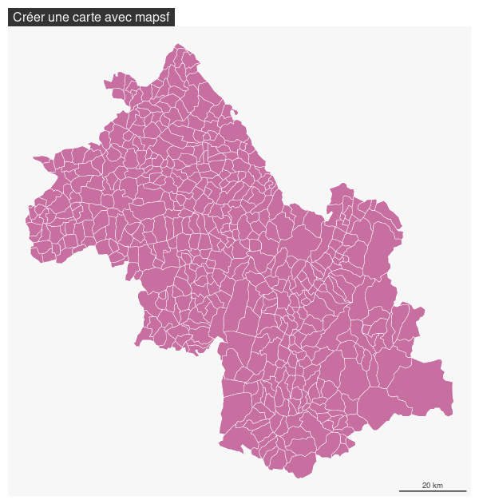
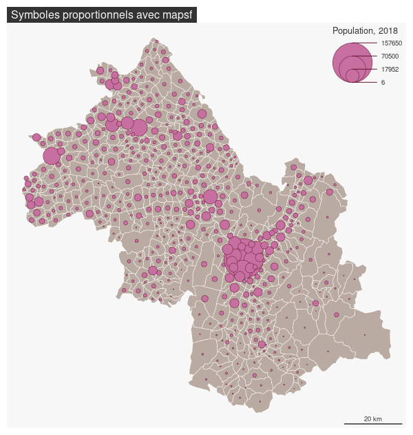
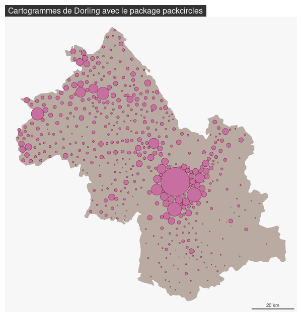
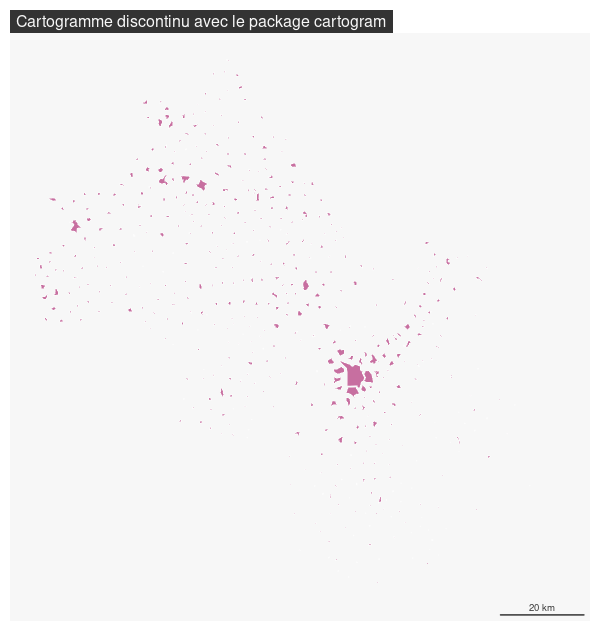
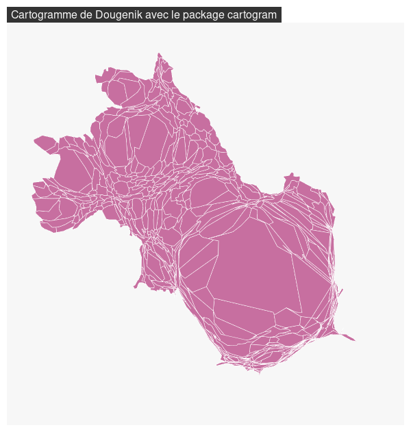

**Lorem Ipsum is simply dummy text of the printing and typesetting industry. Lorem Ipsum has been the industry's standard dummy text ever since the 1500s, when an unknown printer took a galley of type and scrambled it to make a type specimen book. It has survived not only five centuries, but also the leap into electronic typesetting, remaining essentially unchanged. It was popularised in the 1960s with the release of Letraset sheets containing Lorem Ipsum passages, and more recently with desktop publishing software like Aldus PageMaker including versions of Lorem Ipsum.**

# Packages

installer les packages suivants ..... + version min


```{r, eval = FALSE, message = FALSE, warning = FALSE}
install.packages(knitr)
install.packages(sf)
install.packages(mapsf)
install.packages(packcircles)
install.packages(cartogram)
install.packages(recmap)
install.packages("https://cran.r-project.org/src/contrib/Archive/cartogramR/cartogramR_1.0-1.tar.gz", repos = NULL, type = "source")
```


# Import et mise en forme des données

Le package **sf** bla bla bla.....

```{r, eval = TRUE, message = FALSE, warning = FALSE, results = "hide"}
library(sf)
communes <- st_read("data/isere.geojson", quiet = TRUE ) %>% st_transform(2154)
data <- read.csv("data/popisrere.csv",  dec = ",")
communes = merge(x = communes, y = data, by = "id")
```

```{r, eval = TRUE, message = FALSE, warning = FALSE}
knitr::kable(communes[c(0:10),], row.names = F, digits = 1)
```

# Le package mapsf

Le package **[mapsf](https://riatelab.github.io/mapsf/)** permet de faire des cartes thématiques dans R. C'est le package qui succède au package **cartography**. 

```{r, eval = TRUE, message = FALSE, warning = FALSE}
library(mapsf)
mf_export(
  communes,
  export = "png",
  filename = paste0("maps/plot.png"),
  res = 96,
  theme = "default"
)
mf_map(communes, col = "#c76fa0", border = "white", lwd = 0.5, add = TRUE)
mf_title("Créer une carte avec mapsf")
mf_scale(size = 20, pos = "bottomright", lwd = 1.5, cex = 0.6, col = "#383838", unit = "km")
dev.off()
```

</img>

Représenter des données quantitatives absolues.

```{r, eval = TRUE, message = FALSE, warning = FALSE}

mf_export(
  communes,
  export = "png",
  filename = paste0("maps/proSymbols.png"),
  res = 96,
  theme = "default"
)
mf_map(communes, col = "#baaba2",border = "white", lwd = 0.5, add = TRUE)
mf_map(communes, var = "pop2018", type = "prop", col = "#c76fa0",
       border = "#61122f", lwd = 0.5, leg_title = "Population, 2018", 
       add = TRUE)
mf_title("Symboles proportionnels avec mapsf")
mf_scale(size = 20, pos = "bottomright", lwd = 1.5,
         cex = 0.6, col = "#383838", unit = "km")
dev.off()
```

</img>

# Le package packcircles (R >= 3.2)

Le package *packcirles* propose 3 algorithmes simples pour déplacer des diques sur un plan 2D de telle sorte qu'ils ne se supperposent pas. Nous pouvons l'utiliser pour créer des cartogrammes de Dorling [@dorling1996area].

Création d'un ficher de données siplifié avec les coordonnées des centroides des communes.

```{r, eval = TRUE, message = FALSE, warning = FALSE}
dots = communes
st_geometry(dots) <- st_centroid(sf::st_geometry(dots),of_largest_polygon = TRUE)
dots <- data.frame(dots$id, dots["pop2018"], st_coordinates(dots))
dots = dots[,c("dots.id","X","Y","pop2018")]
colnames(dots) <- c("id","x","y","v")
dots <- dots[!is.na(dots$v),]
knitr::kable(dots[c(0:5),], row.names = F, digits = 1)
```

La fonction *circleRepelLayout* prend un ensemble de cercles dans un cadre de données et utilise la répulsion itérative pour essayer de trouver un arrangement sans chevauchement où tous les centres des cercles se trouvent à l'intérieur d'un rectangle de délimitation. Si aucun arrangement de ce type ne peut être trouvé dans le nombre maximum d'itérations spécifié, la dernière tentative est renvoyée.

```{r, eval = TRUE, message = FALSE, warning = FALSE}
library("packcircles")
k = 300 # pour ajuster la taille des cercles
itermax = 10 # nombre d'iterations
dat.init <- dots[,c("x","y","v")]
dat.init$v <- sqrt(dat.init$v * k)
simulation <- circleRepelLayout(x = dat.init, xysizecols = 1:3,
                                wrap = FALSE, sizetype = "radius",
                                maxiter = itermax, weights =1)$layout
knitr::kable(simulation[c(0:5),], row.names = F, digits = 1)
```

Affichage cartographique

```{r, eval = TRUE, message = FALSE, warning = FALSE}
circles <- st_buffer(sf::st_as_sf(simulation, coords =c('x', 'y'),
                      crs = sf::st_crs(communes)), dist = simulation$radius)
circles$v = dots$v

mf_export(
  communes,
  export = "png",
  filename = paste0("maps/dorling.png"),
  res = 96,
  theme = "default"
)
mf_map(communes, col = "#baaba2",border = "#baaba2", lwd = 0.5, add = TRUE)
mf_map(circles, col = "#c76fa0",border = "#61122f", lwd = 0.5, add = TRUE)

mf_title("Cartogrammes de Dorling avec le package packcircles")
mf_scale(size = 20, pos = "bottomright", lwd = 1.5,
         cex = 0.6, col = "#383838", unit = "km")
dev.off()

```

</img>

# Le package cartogram

Il propose entre autre une façon de faire des cartogrammes de Dorling un peu plus simple.

```{r, eval = TRUE, message = FALSE, warning = FALSE}
library(cartogram)
dorling = cartogram_dorling(communes, "pop2018", k = 1)
```

```{r, eval = TRUE, message = FALSE, warning = FALSE}
mf_export(
  communes,
  export = "png",
  filename = paste0("maps/dorling2.png"),
  res = 96,
  theme = "default"
)
mf_map(communes, col = "#baaba2",border = "#baaba2", lwd = 0.5, add = TRUE)
mf_map(st_geometry(dorling), col = "#c76fa0",border = "#61122f", lwd = 0.5, add = TRUE)
mf_title("Cartogramme de Dorling avec le package cartogram")
mf_scale(size = 20, pos = "bottomright", lwd = 1.5,
         cex = 0.6, col = "#383838", unit = "km")
dev.off()

```

</img>

### Cartogrames discontinus (Olsen)

Bla bla bla.... [@olson1976noncontiguous]

```{r, eval = TRUE, message = FALSE, warning = FALSE}
Olsen <- cartogram_ncont(communes, "pop2018")

```

```{r, eval = TRUE, message = FALSE, warning = FALSE}
mf_export(
  communes,
  export = "png",
  filename = paste0("maps/Olsen.png"),
  res = 96,
  theme = "default"
)
mf_map(Olsen, col = "#c76fa0",border = "white", lwd = 0.5, add = TRUE)
mf_title("Cartogramme discontinu avec le package cartogram")
mf_scale(size = 20, pos = "bottomright", lwd = 1.5,
         cex = 0.6, col = "#383838", unit = "km")
dev.off()

```

</img>

### Cartogrammes contigus (Dougnik)

Bla bla bla.... [@dougenik1985algorithm]


```{r, eval = TRUE, message = FALSE, warning = FALSE}
Dougenik <- cartogram_cont(communes, "pop2018", prepare = "none", itermax = 150, maxSizeError = 1.5)
```

```{r, eval = TRUE, message = FALSE, warning = FALSE}
mf_export(
  communes,
  export = "png",
  filename = paste0("maps/Dougenik.png"),
  res = 96,
  theme = "default"
)
mf_map(Dougenik, col = "#c76fa0",border = "white", lwd = 0.5, add = TRUE)
mf_title("Cartogramme de Dougenik avec le package cartogram")
dev.off()

```

</img>

# Recmap


Recmap [@heilmann2004recmap] [@panse2016rectangular] est un package développé par Christian Panse. Il perlet de concertir les géométries des unités spatiales en rectangles dont la surace est définie en fonction d'une donnée statitique sauntitative absolue. L'algorithe de RecMap est disponible [ici](https://ieeexplore.ieee.org/document/1382888). Développé en C++11, le package dépend des packages GA (>= 3.1), Rcpp (>= 1.0), sp(>= 1.3)

Attention, il ne fonctionne que sur un nombre limité d'unités territoriales. Et même dans ce cas, il ne fonctionne pas très bien, notamment avec les petites unités spatiales. 

```{r, eval = TRUE, message = FALSE, warning = FALSE}
europe <- st_read("data/europe.geojson")

size = 0.5 # To change se size of rectangles

coords = data.frame(st_coordinates(st_centroid(st_geometry(europe))))
bb <- lapply(st_geometry(europe), function(x){st_bbox(x)})
dx <- unlist(lapply(bb, function(x){x[3]-x[1]})) * size
dy <- unlist(lapply(bb, function(x){x[4]-x[2]})) * size

df <- data.frame(x = coords$X, 
                 y = coords$Y, 
                 dx = dx, 
                 dy = dy, 
                 z = europe$pop2008,
                 name = europe$id)

```

```{r, eval = TRUE, message = FALSE, warning = FALSE}
mf_export(
  europe,
  export = "png",
  filename = paste0("maps/test.png"),
  res = 96,
  theme = "default"
)
plot.recmap(df, col = NA, border = "black",   col.text = 'black', add= TRUE)
dev.off()
```

```{r, eval = TRUE, message = FALSE, warning = FALSE}
cartog <- recmap(df)
plot(cartog,  col = "black", border = "white")
```


# Le package cartogramR

```{r, eval = TRUE, message = FALSE, warning = FALSE}
library("cartogramR")
```

# A vous de jouer

Explorez les cartogrammes à l'échelle mondiale.

# Blibliographie

